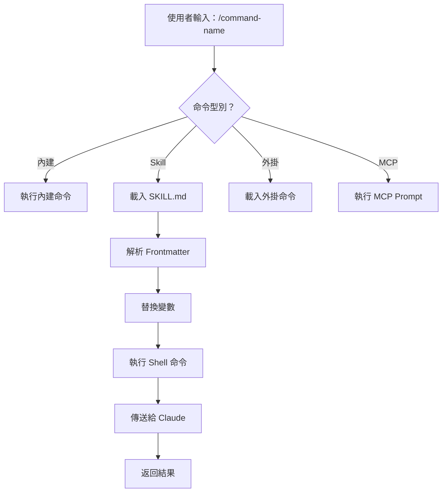
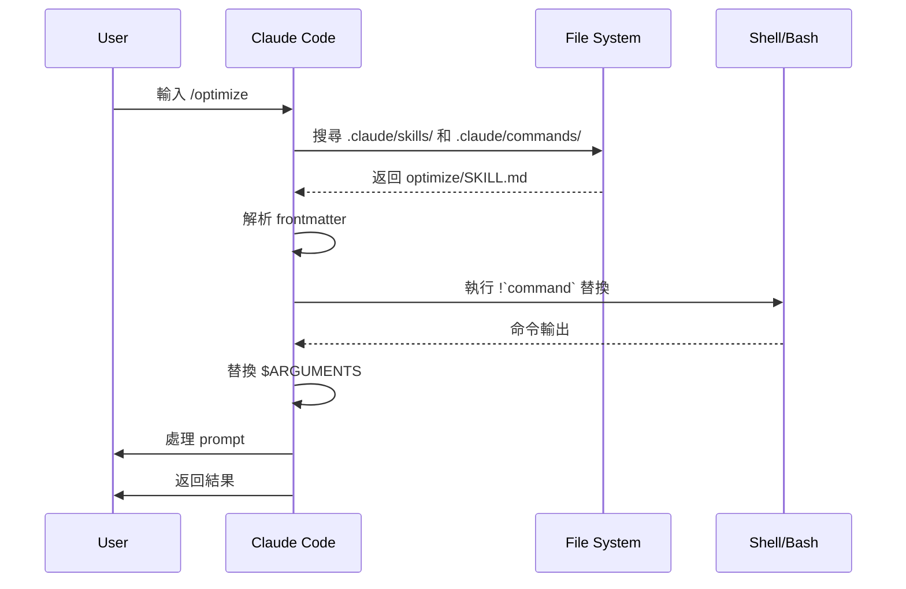

<picture>
  <source media="(prefers-color-scheme: dark)" srcset="../resources/logos/claude-howto-logo-dark.svg">
  
</picture>

# Slash Commands 參考指南

## 概覽

Slash command 是你在 Claude 的互動式會話中用來控制行為的快捷方式，主要分為幾類：

- **內建命令**：Claude Code 自帶，例如 `/help`、`/clear`、`/model`
- **Skills**：你自己定義的命令，基於 `SKILL.md` 檔案，例如 `/optimize`、`/pr`
- **外掛命令**：來自已安裝外掛的命令，例如 `/frontend-design:frontend-design`
- **MCP prompts**：來自 MCP server 的命令，例如 `/mcp__github__list_prs`

> **注意**：自定義 slash command 已經合併進 Skills。`.claude/commands/` 仍然可用，但現在更推薦使用 `.claude/skills/`。兩者都會建立 `/command-name` 形式的快捷命令。完整參考請見 [Skills 指南](../03-skills/README.md)。

## 內建命令速查

Claude Code 目前提供 55+ 個內建命令和 5 個內建 Skills。你可以在 Claude Code 中輸入 `/` 檢視全部，也可以輸入 `/` 後繼續鍵入字母進行篩選。

| 命令 | 作用 |
|---------|---------|
| `/add-dir <path>` | 新增工作目錄 |
| `/agents` | 管理 agent 配置 |
| `/branch [name]` | 將當前對話分支到新會話（別名：`/fork`。注意：`/fork` 在 v2.1.77 中更名為 `/branch`） |
| `/btw <question>` | 額外問題，不寫入歷史 |
| `/chrome` | 配置 Chrome 瀏覽器整合 |
| `/clear` | 清空對話（別名：`/reset`、`/new`） |
| `/color [color|default]` | 設定提示欄顏色 |
| `/compact [instructions]` | 壓縮對話，可附帶聚焦指令 |
| `/config` | 開啟設定（別名：`/settings`） |
| `/context` | 用彩色網格視覺化上下文佔用 |
| `/copy [N]` | 將 assistant 回覆複製到剪貼簿；`w` 會寫入檔案 |
| `/cost` | 檢視 token 使用統計 |
| `/desktop` | 繼續在桌面應用中處理（別名：`/app`） |
| `/diff` | 檢視未提交更改的互動式 diff |
| `/doctor` | 檢查安裝健康狀態 |
| `/effort [low|medium|high|max|auto]` | 設定推理強度；`max` 需要 Opus 4.6 |
| `/exit` | 退出 REPL（別名：`/quit`） |
| `/export [filename]` | 將當前對話匯出為檔案或剪貼簿內容 |
| `/extra-usage` | 配置額外用量以應對速率限制 |
| `/fast [on|off]` | 切換快速模式 |
| `/feedback` | 提交反饋（別名：`/bug`） |
| `/help` | 顯示幫助 |
| `/hooks` | 檢視 hook 配置 |
| `/ide` | 管理 IDE 整合 |
| `/init` | 初始化 `CLAUDE.md`，可設定 `CLAUDE_CODE_NEW_INIT=1` 啟用互動式流程 |
| `/insights` | 生成會話分析報告 |
| `/install-github-app` | 配置 GitHub Actions app |
| `/install-slack-app` | 安裝 Slack app |
| `/keybindings` | 開啟快捷鍵配置 |
| `/login` | 切換 Anthropic 賬號 |
| `/logout` | 退出當前 Anthropic 賬號 |
| `/mcp` | 管理 MCP servers 和 OAuth |
| `/memory` | 編輯 `CLAUDE.md`，切換自動記憶 |
| `/mobile` | 生成移動端掃碼二維碼（別名：`/ios`、`/android`） |
| `/model [model]` | 選擇模型，並可用左右箭頭調整 effort |
| `/passes` | 分享一週免費 Claude Code 使用權 |
| `/permissions` | 檢視或更新許可權（別名：`/allowed-tools`） |
| `/plan [description]` | 進入規劃模式 |
| `/plugin` | 管理外掛 |
| `/pr-comments [PR]` | 獲取 GitHub PR 評論 |
| `/privacy-settings` | 隱私設定（僅 Pro/Max） |
| `/release-notes` | 檢視更新日誌 |
| `/reload-plugins` | 重新載入當前外掛 |
| `/remote-control` | 從 claude.ai 進行遠端控制（別名：`/rc`） |
| `/remote-env` | 配置預設遠端環境 |
| `/rename [name]` | 重新命名會話 |
| `/resume [session]` | 恢復對話（別名：`/continue`） |
| `/review` | **已棄用**，請改用 `code-review` 外掛 |
| `/rewind` | 回退對話和/或程式碼（別名：`/checkpoint`） |
| `/sandbox` | 切換沙盒模式 |
| `/schedule [description]` | 建立/管理定時任務 |
| `/security-review` | 分析分支中的安全漏洞 |
| `/skills` | 列出可用 Skills |
| `/stats` | 視覺化每日使用量、會話和連續天數 |
| `/status` | 顯示版本、模型、賬號 |
| `/statusline` | 配置狀態列 |
| `/tasks` | 列出/管理後臺任務 |
| `/terminal-setup` | 配置終端快捷鍵 |
| `/theme` | 更改顏色主題 |
| `/voice` | 切換按住說話語音輸入 |

### 內建 Skills

以下 Skills 隨 Claude Code 一起提供，呼叫方式和 slash command 一樣：

| Skill | 作用 |
|-------|---------|
| `/batch <instruction>` | 使用 worktree 編排大規模並行修改 |
| `/claude-api` | 載入 Claude API 參考，便於為專案所用語言編寫程式碼 |
| `/debug [description]` | 啟用除錯日誌 |
| `/loop [interval] <prompt>` | 按固定間隔重複執行提示詞 |
| `/simplify [focus]` | 審查改動檔案的程式碼質量 |

### 已棄用命令

| 命令 | 狀態 |
|---------|--------|
| `/review` | 已棄用，已被 `code-review` 外掛替代 |
| `/output-style` | 自 v2.1.73 起棄用 |
| `/fork` | 已重新命名為 `/branch`（別名仍可用，v2.1.77） |
| `/vim` | 自 v2.1.92 起移除；改用 `/config → Editor mode` |

### 最近變化

- `/fork` 已更名為 `/branch`，但保留 `/fork` 作為別名（v2.1.77）
- `/output-style` 已棄用（v2.1.73）
- `/review` 已棄用，推薦改用 `code-review` 外掛
- 新增 `/effort`，其中 `max` 級別需要 Opus 4.6
- 新增 `/voice`，用於按住說話語音輸入
- 新增 `/schedule`，用於建立和管理定時任務
- 新增 `/color`，用於自定義提示欄顏色
- `/model` 選擇器現在顯示人類可讀標籤，例如 “Sonnet 4.6”
- `/resume` 支援 `/continue` 別名
- MCP prompts 可作為 `/mcp__<server>__<prompt>` 命令使用，見 [MCP Prompts as Commands](#mcp-prompts-作為命令)

## 自定義命令（現已歸入 Skills）

自定義 slash command 已經**合併到 Skills**。兩種方式都可以透過 `/command-name` 呼叫：

| 方式 | 位置 | 狀態 |
|----------|----------|--------|
| **Skills（推薦）** | `.claude/skills/<name>/SKILL.md` | 當前標準 |
| **舊式命令** | `.claude/commands/<name>.md` | 仍可使用 |

如果 skill 和 command 同名，**skill 優先**。例如同時存在 `.claude/commands/review.md` 和 `.claude/skills/review/SKILL.md` 時，會使用 skill 版本。

### 遷移路徑

你現有的 `.claude/commands/` 檔案可以繼續直接使用。若要遷移到 Skills：

**遷移前（Command）：**
```text
.claude/commands/optimize.md
```

**遷移後（Skill）：**
```text
.claude/skills/optimize/SKILL.md
```

### 為什麼用 Skills

- **目錄結構**：可以把指令碼、模板、參考檔案打包在一起
- **自動觸發**：相關場景下 Claude 可以自動呼叫
- **呼叫控制**：可以決定由使用者、Claude 或兩者共同呼叫
- **子 agent 執行**：可在隔離上下文中執行 skill
- **漸進披露**：只在需要時載入額外檔案

### 把自定義命令做成 Skill

建立一個包含 `SKILL.md` 的目錄：

```bash
mkdir -p .claude/skills/my-command
```

**檔案：** `.claude/skills/my-command/SKILL.md`

```yaml
---
name: my-command
description: 這個命令的作用，以及何時使用它
---

# 我的命令

當該命令被觸發時，Claude 需要遵循的說明。

1. 第一步
2. 第二步
3. 第三步
```

### Frontmatter 參考

| 欄位 | 作用 | 預設值 |
|-------|---------|---------|
| `name` | 命令名（會變成 `/name`） | 目錄名 |
| `description` | 簡短說明，幫助 Claude 判斷何時使用 | 第一段 |
| `argument-hint` | 自動補全時顯示的引數提示 | 無 |
| `allowed-tools` | 命令可無許可權使用的工具 | 繼承 |
| `model` | 指定要使用的模型 | 繼承 |
| `disable-model-invocation` | 若為 `true`，只有使用者能呼叫，Claude 不能自動呼叫 | `false` |
| `user-invocable` | 若為 `false`，不會出現在 `/` 選單中 | `true` |
| `context` | 設為 `fork` 時，在隔離 subagent 中執行 | 無 |
| `agent` | `context: fork` 時使用的 agent 型別 | `general-purpose` |
| `hooks` | Skill 範圍內的 hooks（PreToolUse、PostToolUse、Stop） | 無 |

### 引數

命令可以接收引數：

**使用 `$ARGUMENTS` 接收全部引數：**

```yaml
---
name: fix-issue
description: 根據編號修復 GitHub issue
---

按團隊編碼規範修復 #$ARGUMENTS
```

呼叫 `/fix-issue 123` 時，`$ARGUMENTS` 會變成 `123`。

**使用 `$0`、`$1` 等接收單個引數：**

```yaml
---
name: review-pr
description: 按優先順序審查 PR
---

審查 #$0，優先順序為 $1
```

呼叫 `/review-pr 456 high` 時，`$0="456"`，`$1="high"`。

### 用 Shell 命令注入動態上下文

在 prompt 傳送前，可用 `!` 命令先執行 shell 命令：

```yaml
---
name: commit
description: 使用上下文建立 git commit
allowed-tools: Bash(git *)
---

## 上下文

- 當前 git 狀態：!`git status`
- 當前 diff：!`git diff HEAD`
- 當前分支：!`git branch --show-current`
- 最近提交：!`git log --oneline -5`

## 你的任務

根據以上變更，建立一個 git commit。
```

### 檔案引用

使用 `@` 引用檔案內容：

```markdown
審查 @src/utils/helpers.js 中的實現
比較 @src/old-version.js 和 @src/new-version.js
```

## 外掛命令

外掛可以提供自定義命令：

```text
/plugin-name:command-name
```

如果沒有命名衝突，也可以直接使用 `/command-name`。

**示例：**
```bash
/frontend-design:frontend-design
/commit-commands:commit
```

## MCP Prompts 作為命令

MCP servers 可以把 prompt 暴露成 slash command：

```text
/mcp__<server-name>__<prompt-name> [arguments]
```

**示例：**
```bash
/mcp__github__list_prs
/mcp__github__pr_review 456
/mcp__jira__create_issue "Bug title" high
```

### MCP 許可權語法

在許可權中控制 MCP server 訪問：

- `mcp__github` - 訪問整個 GitHub MCP server
- `mcp__github__*` - 萬用字元訪問全部工具
- `mcp__github__get_issue` - 訪問某個特定工具

## 命令架構



## 命令生命週期



## 本檔案中的可用命令

這些示例命令可以作為 skill 或舊式命令安裝。

### 1. `/optimize` - 程式碼最佳化

分析效能問題、記憶體洩漏和最佳化機會。

**用法：**
```text
/optimize
[貼上你的程式碼]
```

**檔案：** [optimize.md](optimize.md)

### 2. `/pr` - Pull Request 準備

引導你完成 PR 準備清單，包括 lint、測試和提交格式整理。

**用法：**
```text
/pr
```

**檔案：** [pr.md](pr.md)

**截圖：**


### 3. `/generate-api-docs` - API 檔案生成器

從原始碼生成完整的 API 檔案。

**用法：**
```text
/generate-api-docs
```

**檔案：** [generate-api-docs.md](generate-api-docs.md)

### 4. `/commit` - 帶上下文的 Git Commit

基於倉庫中的動態上下文建立 git commit。

**用法：**
```text
/commit [可選說明]
```

**檔案：** [commit.md](commit.md)

### 5. `/push-all` - 暫存、提交併推送

會先暫存所有改動，再提交，並帶安全檢查地推送到遠端。

**用法：**
```text
/push-all
```

**檔案：** [push-all.md](push-all.md)

**安全檢查：**
- 金鑰檔案：`.env*`、`*.key`、`*.pem`、`credentials.json`
- API Keys：識別真實 key 與佔位符
- 大檔案：未使用 Git LFS 且大於 10MB
- 構建產物：`node_modules/`、`dist/`、`__pycache__/`

### 6. `/doc-refactor` - 檔案重構

重組專案檔案，讓結構更清晰、可訪問性更好。

**檔案：** [doc-refactor.md](doc-refactor.md)

### 7. `/setup-ci-cd` - CI/CD 流水線配置

實現 pre-commit hooks 和 GitHub Actions 質量保障流程。

**檔案：** [setup-ci-cd.md](setup-ci-cd.md)

### 8. `/unit-test-expand` - 測試覆蓋率擴充套件

針對未測試分支和邊界情況，提升測試覆蓋率。

**檔案：** [unit-test-expand.md](unit-test-expand.md)

## 安裝

### 作為 Skills（推薦）

複製到你的 skills 目錄：

```bash
# 建立 skills 目錄
mkdir -p .claude/skills

# 對每個命令檔案，建立一個 skill 目錄
for cmd in optimize pr commit; do
  mkdir -p .claude/skills/$cmd
  cp 01-slash-commands/$cmd.md .claude/skills/$cmd/SKILL.md
done
```

### 作為舊式命令

複製到 commands 目錄：

```bash
# 專案範圍（團隊）
mkdir -p .claude/commands
cp 01-slash-commands/*.md .claude/commands/

# 個人使用
mkdir -p ~/.claude/commands
cp 01-slash-commands/*.md ~/.claude/commands/
```

## 建立你自己的命令

### Skill 模板（推薦）

建立 `.claude/skills/my-command/SKILL.md`：

```yaml
---
name: my-command
description: 這個命令做什麼。用於 [觸發條件]。
argument-hint: [可選引數]
allowed-tools: Bash(npm *), Read, Grep
---

# Command Title

## 上下文

- 當前分支：!`git branch --show-current`
- 相關檔案：@package.json

## 指令

1. 第一步
2. 第二步，引數：$ARGUMENTS
3. 第三步

## 輸出格式

- 如何格式化回覆
- 需要包含什麼
```

### 僅使用者可呼叫的命令（無自動觸發）

對於帶副作用、Claude 不應自動觸發的命令：

```yaml
---
name: deploy
description: 部署到生產環境
disable-model-invocation: true
allowed-tools: Bash(npm *), Bash(git *)
---

將應用部署到生產環境：

1. 執行測試
2. 構建應用
3. 推送到部署目標
4. 驗證部署
```

## 最佳實踐

| 應該做 | 不要做 |
|------|---------|
| 使用清晰、以動作導向的命名 | 為一次性任務建立命令 |
| 在 `description` 中寫清觸發條件 | 在命令裡寫太複雜的邏輯 |
| 保持命令聚焦於單一任務 | 硬編碼敏感資訊 |
| 有副作用時使用 `disable-model-invocation` | 跳過 description 欄位 |
| 用 `!` 字首注入動態上下文 | 假設 Claude 知道當前狀態 |
| 把相關檔案組織進 skill 目錄 | 所有內容都塞進一個檔案 |

## 故障排查

### 找不到命令

**解決辦法：**
- 檢查檔案是否位於 `.claude/skills/<name>/SKILL.md` 或 `.claude/commands/<name>.md`
- 確認 frontmatter 中的 `name` 與預期命令名一致
- 重啟 Claude Code 會話
- 執行 `/help` 檢視可用命令

### 命令沒有按預期執行

**解決辦法：**
- 補充更具體的指令
- 在 skill 檔案中加入示例
- 如果使用 bash 命令，檢查 `allowed-tools`
- 先用簡單輸入測試

### Skill 與 Command 衝突

如果同名同時存在，**skill 優先**。刪除其中一個或重新命名即可。

## 相關指南

- **[Skills](../03-skills/README.md)** - 完整的 Skills 參考
- **[Memory](../02-memory/README.md)** - 帶 `CLAUDE.md` 的持久上下文
- **[Subagents](../04-subagents/README.md)** - 委派式 AI agents
- **[Plugins](../07-plugins/README.md)** - 打包好的命令集合
- **[Hooks](../06-hooks/README.md)** - 事件驅動自動化

## 其他資源

- [官方互動模式檔案](https://code.claude.com/docs/en/interactive-mode) - 內建命令參考
- [官方 Skills 檔案](https://code.claude.com/docs/en/skills) - 完整 Skills 參考
- [CLI Reference](https://code.claude.com/docs/en/cli-reference) - 命令列選項

---

**最後更新**: 2026 年 4 月 9 日
**Claude Code 版本**: 2.1.97

---

*Claude How To 指南系列的一部分*
