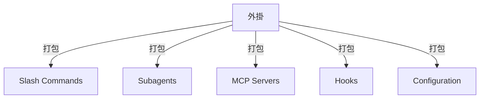
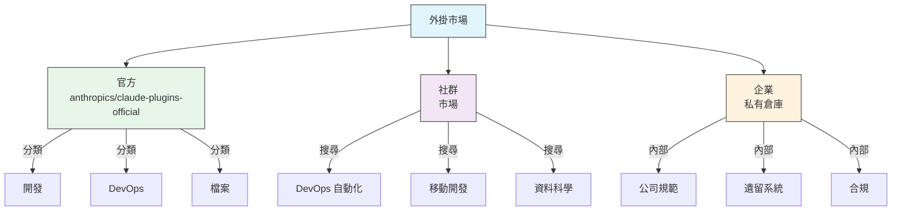
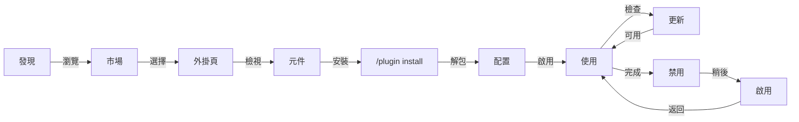
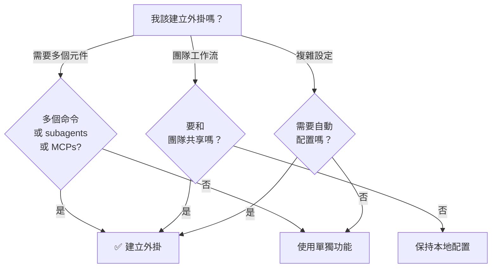

<picture>
  <source media="(prefers-color-scheme: dark)" srcset="../resources/logos/claude-howto-logo-dark.svg">
  
</picture>

# Claude Code 外掛

這個目錄包含一組完整的外掛示例，它們把多個 Claude Code 功能打包成可安裝的一體化方案。

## 介紹

Claude Code 外掛是把 slash commands、subagents、MCP servers 和 hooks 組合在一起的功能集合，可以透過一條命令安裝。它們代表了 Claude Code 最高階別的擴充套件方式，把多個功能整合成可共享、可複用的完整方案。

## 概覽

一個外掛通常會把以下能力打包在一起：

- slash commands
- subagents
- MCP servers
- hooks

這樣做的好處是：

- 一次安裝即可使用完整工作流
- 團隊共享更容易
- 配置更統一
- 便於版本控制和分發

## 外掛架構



## 外掛型別與分發

| 型別 | 範圍 | 共享物件 | 維護者 | 示例 |
|------|------|----------|--------|------|
| 官方 | 全域性 | 所有使用者 | Anthropic | PR 審查、安全指導 |
| 社群 | 公開 | 所有使用者 | 社群 | DevOps、資料科學 |
| 組織 | 內部 | 團隊成員 | 公司 | 內部規範、工具 |
| 個人 | 個人 | 單個使用者 | 開發者 | 自定義工作流 |

## 外掛定義結構

外掛清單使用 `.claude-plugin/plugin.json` 中的 JSON 格式：

```json
{
  "name": "my-first-plugin",
  "description": "一個問候外掛",
  "version": "1.0.0",
  "author": {
    "name": "Your Name"
  },
  "homepage": "https://example.com",
  "repository": "https://github.com/user/repo",
  "license": "MIT"
}
```

## 外掛結構示例

```
my-plugin/
├── .claude-plugin/
│   └── plugin.json       # 清單（名稱、描述、版本、作者）
├── commands/             # 以 Markdown 檔案形式存放的命令
│   ├── task-1.md
│   ├── task-2.md
│   └── workflows/
├── agents/               # 自定義 agent 定義
│   ├── specialist-1.md
│   ├── specialist-2.md
│   └── configs/
├── skills/               # 帶有 SKILL.md 檔案的技能
│   ├── skill-1.md
│   └── skill-2.md
├── hooks/                # hooks.json 中的事件處理器
│   └── hooks.json
├── .mcp.json             # MCP server 配置
├── .lsp.json             # LSP server 配置
├── settings.json         # 預設設定
├── templates/
│   └── issue-template.md
├── scripts/
│   ├── helper-1.sh
│   └── helper-2.py
├── docs/
│   ├── README.md
│   └── USAGE.md
└── tests/
    └── plugin.test.js
```

### LSP server 配置

外掛可以包含 Language Server Protocol（LSP）支援，以獲得實時程式碼智慧。LSP server 會在你編寫程式碼時提供診斷、程式碼導航和符號資訊。

**配置位置**：
- 外掛根目錄中的 `.lsp.json` 檔案
- `plugin.json` 中的內聯 `lsp` 鍵

#### 欄位參考

| 欄位 | 必填 | 說明 |
|------|------|------|
| `command` | 是 | LSP server 可執行檔案（必須在 PATH 中） |
| `extensionToLanguage` | 是 | 將副檔名對映到語言 ID |
| `args` | 否 | server 的命令列引數 |
| `transport` | 否 | 通訊方式：`stdio`（預設）或 `socket` |
| `env` | 否 | server 程式的環境變數 |
| `initializationOptions` | 否 | LSP 初始化期間傳送的選項 |
| `settings` | 否 | 傳遞給 server 的工作區配置 |
| `workspaceFolder` | 否 | 覆蓋工作區資料夾路徑 |
| `startupTimeout` | 否 | 等待 server 啟動的最長時間（毫秒） |
| `shutdownTimeout` | 否 | 優雅關閉的最長時間（毫秒） |
| `restartOnCrash` | 否 | server 崩潰時自動重啟 |
| `maxRestarts` | 否 | 放棄前的最大重啟次數 |

#### 示例配置

**Go（gopls）**：

```json
{
  "go": {
    "command": "gopls",
    "args": ["serve"],
    "extensionToLanguage": {
      ".go": "go"
    }
  }
}
```

**Python（pyright）**：

```json
{
  "python": {
    "command": "pyright-langserver",
    "args": ["--stdio"],
    "extensionToLanguage": {
      ".py": "python",
      ".pyi": "python"
    }
  }
}
```

**TypeScript**：

```json
{
  "typescript": {
    "command": "typescript-language-server",
    "args": ["--stdio"],
    "extensionToLanguage": {
      ".ts": "typescript",
      ".tsx": "typescriptreact",
      ".js": "javascript",
      ".jsx": "javascriptreact"
    }
  }
}
```

#### 可用的 LSP 外掛

官方市場包含了預配置好的 LSP 外掛：

| 外掛 | 語言 | Server Binary | 安裝命令 |
|------|------|---------------|----------|
| `pyright-lsp` | Python | `pyright-langserver` | `pip install pyright` |
| `typescript-lsp` | TypeScript/JavaScript | `typescript-language-server` | `npm install -g typescript-language-server typescript` |
| `rust-lsp` | Rust | `rust-analyzer` | 使用 `rustup component add rust-analyzer` 安裝 |

#### LSP 能力

配置完成後，LSP server 會提供：

- **即時診斷** - 編輯後立即顯示錯誤和警告
- **程式碼導航** - 跳轉到定義、查詢引用和實現
- **懸浮資訊** - 在懸停時檢視型別簽名和檔案
- **符號列表** - 瀏覽當前檔案或工作區中的符號

## 外掛選項（v2.1.83+）

外掛可以在清單中透過 `userConfig` 宣告使用者可配置選項。標記為 `sensitive: true` 的值會儲存在系統鑰匙串中，而不是明文設定檔案裡：

```json
{
  "name": "my-plugin",
  "version": "1.0.0",
  "userConfig": {
    "apiKey": {
      "description": "服務的 API key",
      "sensitive": true
    },
    "region": {
      "description": "部署區域",
      "default": "us-east-1"
    }
  }
}
```

## 持久化外掛資料（`${CLAUDE_PLUGIN_DATA}`）（v2.1.78+）

外掛可以透過 `${CLAUDE_PLUGIN_DATA}` 環境變數訪問一個持久化狀態目錄。這個目錄對每個外掛都是唯一的，並且會跨會話保留，適合快取、資料庫和其他持久化狀態：

```json
{
  "hooks": {
    "PostToolUse": [
      {
        "command": "node ${CLAUDE_PLUGIN_DATA}/track-usage.js"
      }
    ]
  }
}
```

外掛安裝時會自動建立該目錄。存放在這裡的檔案會一直保留，直到外掛被解除安裝。

## 透過設定檔案內聯定義外掛（`source: 'settings'`）（v2.1.80+）

外掛可以在設定檔案中以內聯市場條目的方式定義，使用 `source: 'settings'` 欄位即可。這允許你直接嵌入外掛定義，而不必單獨準備倉庫或市場：

```json
{
  "pluginMarketplaces": [
    {
      "name": "inline-tools",
      "source": "settings",
      "plugins": [
        {
          "name": "quick-lint",
          "source": "./local-plugins/quick-lint"
        }
      ]
    }
  ]
}
```

## 外掛設定

外掛可以提供一個 `settings.json` 檔案來定義預設配置。目前支援 `agent` 鍵，用來指定外掛的主執行緒 agent：

```json
{
  "agent": "agents/specialist-1.md"
}
```

當外掛包含 `settings.json` 時，這些預設值會在安裝時自動應用。使用者也可以在自己的專案或使用者級配置中覆蓋它們。

## 獨立命令 vs 外掛方式

| 方式 | 命令名稱 | 配置方式 | 最適合 |
|------|----------|----------|--------|
| **獨立命令** | `/hello` | 在 `CLAUDE.md` 中手動設定 | 個人、專案專用 |
| **外掛** | `/plugin-name:hello` | 透過 `plugin.json` 自動配置 | 共享、分發、團隊使用 |

對於快速的個人工作流，使用 **獨立 slash commands**。當你想打包多個功能、與團隊共享或者釋出分發時，使用 **外掛**。

## 實際示例

### 示例 1：PR 審查外掛

**檔案：** `.claude-plugin/plugin.json`

```json
{
  "name": "pr-review",
  "version": "1.0.0",
  "description": "包含安全、測試和檔案檢查的完整 PR 審查工作流",
  "author": {
    "name": "Anthropic"
  },
  "repository": "https://github.com/your-org/pr-review",
  "license": "MIT"
}
```

**檔案：** `commands/review-pr.md`

```markdown
---
name: Review PR
description: 啟動包含安全和測試檢查的完整 PR 審查
---

# PR Review

這個命令會啟動一次完整的 Pull Request 審查，包括：

1. 安全分析
2. 測試覆蓋率驗證
3. 檔案更新
4. 程式碼質量檢查
5. 效能影響評估
```

**檔案：** `agents/security-reviewer.md`

```yaml
---
name: security-reviewer
description: 面向安全的程式碼審查
tools: read, grep, diff
---

# Security Reviewer

專注於發現安全漏洞：
- 身份驗證/授權問題
- 資料暴露
- 注入攻擊
- 安全配置
```

**安裝：**

```bash
/plugin install pr-review

# 結果：
# ✅ 已安裝 3 個 slash commands
# ✅ 已配置 3 個 subagents
# ✅ 已連線 2 個 MCP servers
# ✅ 已註冊 4 個 hooks
# ✅ 可以直接使用！
```

### 示例 2：DevOps 外掛

**元件：**

```
devops-automation/
├── commands/
│   ├── deploy.md
│   ├── rollback.md
│   ├── status.md
│   └── incident.md
├── agents/
│   ├── deployment-specialist.md
│   ├── incident-commander.md
│   └── alert-analyzer.md
├── mcp/
│   ├── github-config.json
│   ├── kubernetes-config.json
│   └── prometheus-config.json
├── hooks/
│   ├── pre-deploy.js
│   ├── post-deploy.js
│   └── on-error.js
└── scripts/
    ├── deploy.sh
    ├── rollback.sh
    └── health-check.sh
```

### 示例 3：檔案外掛

**打包元件：**

```
documentation/
├── commands/
│   ├── generate-api-docs.md
│   ├── generate-readme.md
│   ├── sync-docs.md
│   └── validate-docs.md
├── agents/
│   ├── api-documenter.md
│   ├── code-commentator.md
│   └── example-generator.md
├── mcp/
│   ├── github-docs-config.json
│   └── slack-announce-config.json
└── templates/
    ├── api-endpoint.md
    ├── function-docs.md
    └── adr-template.md
```

## 外掛市場

Anthropic 官方維護的外掛目錄是 `anthropics/claude-plugins-official`。企業管理員也可以建立私有外掛市場用於內部分發。



### 市場配置

企業和高階使用者可以透過設定來控制市場行為：

| 設定 | 說明 |
|------|------|
| `extraKnownMarketplaces` | 在預設列表之外新增額外的市場源 |
| `strictKnownMarketplaces` | 控制允許使用者新增哪些市場 |
| `deniedPlugins` | 管理員維護的黑名單，阻止特定外掛被安裝 |

### 額外的市場特性

- **預設 git 超時**：對大型外掛倉庫從 30 秒增加到 120 秒
- **自定義 npm registry**：外掛可以指定自定義 npm registry URL 用於依賴解析
- **版本鎖定**：將外掛鎖定到特定版本，以獲得可復現的環境

### 市場定義 schema

外掛市場定義在 `.claude-plugin/marketplace.json` 中：

```json
{
  "name": "my-team-plugins",
  "owner": "my-org",
  "plugins": [
    {
      "name": "code-standards",
      "source": "./plugins/code-standards",
      "description": "強制執行團隊編碼規範",
      "version": "1.2.0",
      "author": "platform-team"
    },
    {
      "name": "deploy-helper",
      "source": {
        "source": "github",
        "repo": "my-org/deploy-helper",
        "ref": "v2.0.0"
      },
      "description": "部署自動化工作流"
    }
  ]
}
```

| 欄位 | 必填 | 說明 |
|------|------|------|
| `name` | 是 | 使用 kebab-case 的市場名稱 |
| `owner` | 是 | 維護該市場的組織或使用者 |
| `plugins` | 是 | 外掛條目陣列 |
| `plugins[].name` | 是 | 外掛名稱（kebab-case） |
| `plugins[].source` | 是 | 外掛來源（路徑字串或來源物件） |
| `plugins[].description` | 否 | 外掛的簡要描述 |
| `plugins[].version` | 否 | 語義化版本字串 |
| `plugins[].author` | 否 | 外掛作者名稱 |

### 外掛來源型別

外掛可以來自多個位置：

| 來源 | 語法 | 示例 |
|------|------|------|
| **相對路徑** | 字串路徑 | `"./plugins/my-plugin"` |
| **GitHub** | `{ "source": "github", "repo": "owner/repo" }` | `{ "source": "github", "repo": "acme/lint-plugin", "ref": "v1.0" }` |
| **Git URL** | `{ "source": "url", "url": "..." }` | `{ "source": "url", "url": "https://git.internal/plugin.git" }` |
| **Git 子目錄** | `{ "source": "git-subdir", "url": "...", "path": "..." }` | `{ "source": "git-subdir", "url": "https://github.com/org/monorepo.git", "path": "packages/plugin" }` |
| **npm** | `{ "source": "npm", "package": "..." }` | `{ "source": "npm", "package": "@acme/claude-plugin", "version": "^2.0" }` |
| **pip** | `{ "source": "pip", "package": "..." }` | `{ "source": "pip", "package": "claude-data-plugin", "version": ">=1.0" }` |

GitHub 和 git 來源支援可選的 `ref`（分支/標籤）和 `sha`（提交雜湊）欄位用於版本鎖定。

### 分發方式

**GitHub（推薦）**：
```bash
# 使用者新增你的市場
/plugin marketplace add owner/repo-name
```

**其他 git 服務**（需要完整 URL）：
```bash
/plugin marketplace add https://gitlab.com/org/marketplace-repo.git
```

**私有倉庫**：可以透過 git credential helper 或環境令牌支援。使用者必須有該倉庫的讀取許可權。

**官方市場提交**：可以將外掛提交到 Anthropic 稽核維護的市場，以便更廣泛分發。

### 嚴格模式

控制市場定義與本地 `plugin.json` 檔案的互動方式：

| 設定 | 行為 |
|------|------|
| `strict: true`（預設） | 本地 `plugin.json` 為權威來源；市場條目會對其進行補充 |
| `strict: false` | 市場條目就是完整的外掛定義 |

**配合 `strictKnownMarketplaces` 的組織限制**：

| 值 | 效果 |
|----|------|
| 未設定 | 無限制，使用者可以新增任意市場 |
| 空陣列 `[]` | 鎖定模式，不允許任何市場 |
| 模式陣列 | 白名單模式，只允許匹配的市場被新增 |

```json
{
  "strictKnownMarketplaces": [
    "my-org/*",
    "github.com/trusted-vendor/*"
  ]
}
```

> **警告**：在帶有 `strictKnownMarketplaces` 的嚴格模式下，使用者只能從白名單市場安裝外掛。這適用於需要受控外掛分發的企業環境。

## 外掛安裝與生命週期



## 外掛能力對比

| 功能 | Slash Command | Skill | Subagent | Plugin |
|------|---------------|-------|----------|--------|
| **安裝** | 手動複製 | 手動複製 | 手動配置 | 一條命令 |
| **設定時間** | 5 分鐘 | 10 分鐘 | 15 分鐘 | 2 分鐘 |
| **打包** | 單檔案 | 單檔案 | 單檔案 | 多檔案 |
| **版本管理** | 手動 | 手動 | 手動 | 自動 |
| **團隊共享** | 複製檔案 | 複製檔案 | 複製檔案 | 安裝 ID |
| **更新** | 手動 | 手動 | 手動 | 自動可用 |
| **依賴** | 無 | 無 | 無 | 可能包含 |
| **市場** | 否 | 否 | 否 | 是 |
| **分發** | 倉庫 | 倉庫 | 倉庫 | 市場 |

## 外掛 CLI 命令

所有外掛操作都可以透過 CLI 命令完成：

```bash
claude plugin install <name>@<marketplace>   # 從市場安裝
claude plugin uninstall <name>               # 刪除外掛
claude plugin list                           # 列出已安裝外掛
claude plugin enable <name>                  # 啟用已禁用的外掛
claude plugin disable <name>                 # 禁用外掛
claude plugin validate                       # 驗證外掛結構
```

## 安裝方式

### 從市場安裝
```bash
/plugin install plugin-name
# 或透過 CLI：
claude plugin install plugin-name@marketplace-name
```

### 啟用 / 禁用（自動檢測作用域）
```bash
/plugin enable plugin-name
/plugin disable plugin-name
```

### 本地外掛（用於開發）
```bash
# 本地測試的 CLI 引數（可重複指定多個外掛）
claude --plugin-dir ./path/to/plugin
claude --plugin-dir ./plugin-a --plugin-dir ./plugin-b
```

### 從 Git 倉庫安裝
```bash
/plugin install github:username/repo
```

## 何時建立外掛



### 外掛適用場景

| 場景 | 建議 | 原因 |
|------|------|------|
| **團隊入職** | ✅ 使用外掛 | 即時安裝，包含所有配置 |
| **框架初始化** | ✅ 使用外掛 | 打包框架專屬命令 |
| **企業規範** | ✅ 使用外掛 | 集中分發，版本控制 |
| **快速任務自動化** | ❌ 使用命令 | 太重 |
| **單一領域能力** | ❌ 使用 Skill | 太重，直接用 skill 更合適 |
| **專門化分析** | ❌ 使用 Subagent | 可手動建立，或用 skill |
| **實時資料訪問** | ❌ 使用 MCP | 獨立使用，不要打包 |

## 測試外掛

在釋出前，使用 `--plugin-dir` CLI 引數在本地測試外掛（可以重複指定多個外掛）：

```bash
claude --plugin-dir ./my-plugin
claude --plugin-dir ./my-plugin --plugin-dir ./another-plugin
```

這會用已載入外掛啟動 Claude Code，讓你可以：
- 驗證所有 slash commands 是否可用
- 測試 subagents 和 agents 是否正常工作
- 確認 MCP servers 能正確連線
- 驗證 hooks 的執行
- 檢查 LSP server 配置
- 檢查是否有配置錯誤

## 熱過載

外掛支援開發期間的熱過載。當你修改外掛檔案時，Claude Code 可以自動檢測變化。你也可以手動觸發過載：

```bash
/reload-plugins
```

這會重新讀取所有外掛清單、commands、agents、skills、hooks 以及 MCP/LSP 配置，而無需重啟會話。

## 外掛託管設定

管理員可以使用託管設定在組織範圍內控制外掛行為：

| 設定 | 說明 |
|------|------|
| `enabledPlugins` | 預設啟用的外掛白名單 |
| `deniedPlugins` | 不允許安裝的外掛黑名單 |
| `extraKnownMarketplaces` | 在預設列表之外新增額外市場源 |
| `strictKnownMarketplaces` | 限制使用者允許新增的市場 |
| `allowedChannelPlugins` | 控制每個釋出渠道允許使用哪些外掛 |

這些設定可以透過託管配置檔案應用到組織級別，並且優先於使用者級設定。

## 外掛安全

外掛 subagents 執行在受限沙箱中。以下 frontmatter 鍵在外掛 subagent 定義中**不允許**使用：

- `hooks` - subagents 不能註冊事件處理器
- `mcpServers` - subagents 不能配置 MCP servers
- `permissionMode` - subagents 不能覆蓋許可權模型

這可以確保外掛不會越權，也不會修改主機環境的作用範圍。

## 釋出外掛

**釋出步驟：**

1. 使用所有元件建立外掛結構
2. 編寫 `.claude-plugin/plugin.json` 清單
3. 建立帶檔案的 `README.md`
4. 使用 `claude --plugin-dir ./my-plugin` 在本地測試
5. 提交到外掛市場
6. 經過審查和批准
7. 釋出到市場
8. 使用者即可一條命令安裝

**示例提交：**

```markdown
# PR 審查外掛

## 描述
包含安全、測試和檔案檢查的完整 PR 審查工作流。

## 包含內容
- 3 個用於不同審查型別的 slash commands
- 3 個專門化 subagents
- GitHub 和 CodeQL MCP 整合
- 自動安全掃描 hooks

## 安裝
```bash
/plugin install pr-review
```

## 功能
✅ 安全分析
✅ 測試覆蓋率檢查
✅ 檔案校驗
✅ 程式碼質量評估
✅ 效能影響分析

## 使用
```bash
/review-pr
/check-security
/check-tests
```

## 要求
- Claude Code 1.0+
- GitHub 訪問許可權
- CodeQL（可選）
```

## 外掛 vs 手動配置

**手動設定（2+ 小時）：**
- 逐個安裝 slash commands
- 單獨建立 subagents
- 分別配置 MCP
- 手動設定 hooks
- 記錄所有內容
- 和團隊共享（希望他們能配對）

**使用外掛（2 分鐘）：**
```bash
/plugin install pr-review
# ✅ 一切都已安裝並配置
# ✅ 可以立即使用
# ✅ 團隊可以復現完全相同的設定
```

## 最佳實踐

### 應該做的 ✅
- 使用清晰、描述性的外掛名
- 提供完整 README
- 正確使用語義化版本（semver）
- 一起測試所有元件
- 清楚記錄依賴和要求
- 提供使用示例
- 包含錯誤處理
- 為發現性新增合適標籤
- 保持向後相容
- 保持外掛聚焦且一致
- 包含完整測試
- 記錄所有依賴

### 不要做的 ❌
- 不要打包無關功能
- 不要硬編碼憑據
- 不要跳過測試
- 不要忘記檔案
- 不要建立冗餘外掛
- 不要忽略版本管理
- 不要把元件依賴搞得過於複雜
- 不要忘記優雅處理錯誤

## 安裝說明

### 從市場安裝

1. **瀏覽可用外掛：**
   ```bash
   /plugin list
   ```

2. **檢視外掛詳情：**
   ```bash
   /plugin info plugin-name
   ```

3. **安裝外掛：**
   ```bash
   /plugin install plugin-name
   ```

### 從本地路徑安裝

```bash
/plugin install ./path/to/plugin-directory
```

### 從 GitHub 安裝

```bash
/plugin install github:username/repo
```

### 列出已安裝外掛

```bash
/plugin list --installed
```

### 更新外掛

```bash
/plugin update plugin-name
```

### 禁用 / 啟用外掛

```bash
# 臨時禁用
/plugin disable plugin-name

# 重新啟用
/plugin enable plugin-name
```

### 解除安裝外掛

```bash
/plugin uninstall plugin-name
```

## 相關概念

以下 Claude Code 功能會和外掛一起協作：

- **[Slash Commands](../01-slash-commands/README.md)** - 外掛中打包的單獨命令
- **[Memory](../02-memory/README.md)** - 外掛的持久上下文
- **[Skills](../03-skills/README.md)** - 可以包裝進外掛的領域能力
- **[Subagents](../04-subagents/README.md)** - 作為外掛元件包含的專門化 agent
- **[MCP Servers](../05-mcp/README.md)** - 打包在外掛中的 Model Context Protocol 整合
- **[Hooks](../06-hooks/README.md)** - 觸發外掛工作流的事件處理器

## 完整示例工作流

### PR Review 外掛完整工作流

```
1. 使用者：/review-pr

2. 外掛執行：
   ├── pre-review.js hook 驗證 git repo
   ├── GitHub MCP 獲取 PR 資料
   ├── security-reviewer subagent 分析安全
   ├── test-checker subagent 驗證覆蓋率
   └── performance-analyzer subagent 檢查效能

3. 彙總並展示結果：
   ✅ 安全：沒有發現關鍵問題
   ⚠️  測試：覆蓋率 65%（建議 80%+）
   ✅ 效能：沒有明顯影響
   📝 提供了 12 條建議
```

## 故障排查

### 外掛無法安裝
- 檢查 Claude Code 版本相容性：`/version`
- 用 JSON 校驗器驗證 `plugin.json` 語法
- 檢查網路連線（遠端外掛）
- 檢查許可權：`ls -la plugin/`

### 元件沒有載入
- 驗證 `plugin.json` 中的路徑與實際目錄結構一致
- 檢查檔案許可權：`chmod +x scripts/`
- 檢查元件檔案語法
- 檢視日誌：`/plugin debug plugin-name`

### MCP 連線失敗
- 確認環境變數已正確設定
- 檢查 MCP server 的安裝和健康狀態
- 使用 `/mcp test` 獨立測試 MCP 連線
- 檢視 `mcp/` 目錄中的 MCP 配置

### 安裝後命令不可用
- 確認外掛已成功安裝：`/plugin list --installed`
- 檢查外掛是否已啟用：`/plugin status plugin-name`
- 重啟 Claude Code：`exit` 後重新開啟
- 檢查是否與現有命令衝突

### Hook 執行問題
- 確認 hook 檔案許可權正確
- 檢查 hook 語法和事件名
- 檢視 hook 日誌中的錯誤細節
- 如有可能，手動測試 hooks

## 更多資源

- [官方外掛檔案](https://code.claude.com/docs/en/plugins)
- [發現外掛](https://code.claude.com/docs/en/discover-plugins)
- [外掛市場](https://code.claude.com/docs/en/plugin-marketplaces)
- [外掛參考](https://code.claude.com/docs/en/plugins-reference)
- [MCP Server 參考](https://modelcontextprotocol.io/)
- [Subagent 配置指南](../04-subagents/README.md)
- [Hook 系統參考](../06-hooks/README.md)
