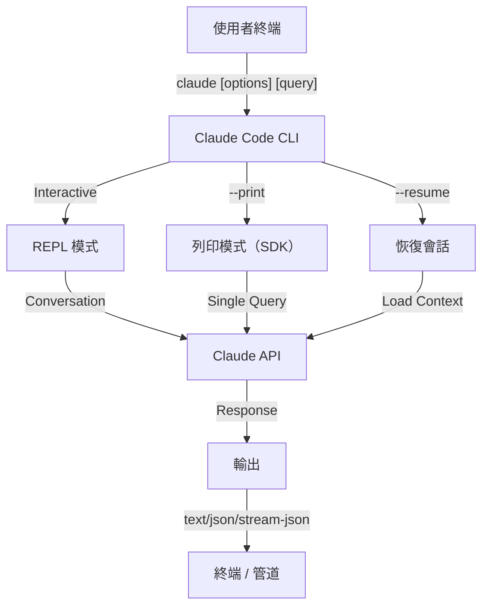
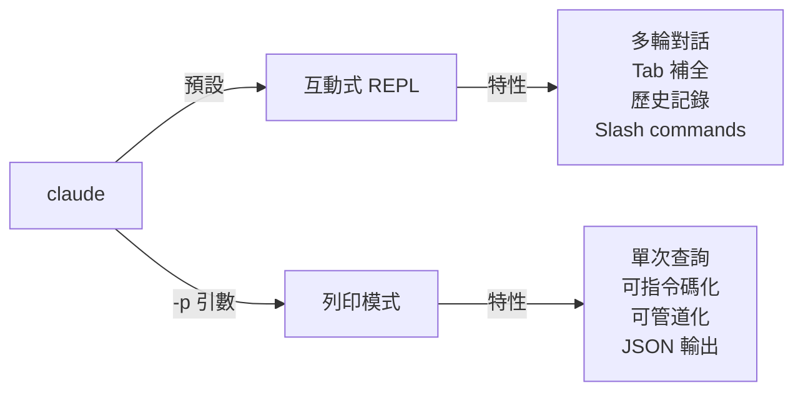

<picture>
  <source media="(prefers-color-scheme: dark)" srcset="../resources/logos/claude-howto-logo-dark.svg">
  
</picture>

# CLI 參考

> 🔎 **權威速查**:[flags-reference.md](flags-reference.md) 依官方 cli-reference 整理完整 flag 對照表。若本檔與該檔衝突,以 `flags-reference.md` 為準。
> 📖 **Print 模式深度用法**:[print-mode.md](print-mode.md)。
>
> **已知本檔歷史性失準**(請以 `flags-reference.md` 為準):
> - `--enable-auto-mode` 已在 v2.1.111 移除,用 `--permission-mode auto` 取代
> - `--mcp-list`、`--mcp` 官方沒有,用 `claude mcp list` / `claude mcp add` 子命令
> - `--working-directory` 官方沒有,用 `--add-dir` 或 `cd` 後啟動 `claude`
> - `--session`、`--new-session`、`--resume-last` 官方沒有,用 `--name`、`-c`、`-r`
> - `--dry-run`、`--unsafe`、`--interactive`、`--disable-auto-checkpoints` 等未在官方清單中

## 概覽

Claude Code 的 CLI(命令列介面)是與 Claude Code 互動的主要方式。它提供了強大的引數和命令,用於執行查詢、管理會話、配置模型,並把 Claude 整合進你的開發工作流。

## 架構



## CLI 命令

| 命令 | 說明 | 示例 |
|---------|-------------|---------|
| `claude` | 啟動互動式 REPL | `claude` |
| `claude "query"` | 帶初始提示啟動 REPL | `claude "解釋這個專案"` |
| `claude -p "query"` | 列印模式，查詢後退出 | `claude -p "解釋這個函式"` |
| `cat file \| claude -p "query"` | 處理透過管道傳入的內容 | `cat logs.txt \| claude -p "解釋這些日誌"` |
| `claude -c` | 繼續最近一次會話 | `claude -c` |
| `claude -c -p "query"` | 在列印模式下繼續會話 | `claude -c -p "檢查型別錯誤"` |
| `claude -r "<session>" "query"` | 透過 ID 或名稱恢復會話 | `claude -r "auth-refactor" "完成這個 PR"` |
| `claude update` | 更新到最新版本 | `claude update` |
| `claude mcp` | 配置 MCP servers | 見 [MCP 檔案](../05-mcp/README.md) |
| `claude mcp serve` | 將 Claude Code 作為 MCP server 執行 | `claude mcp serve` |
| `claude agents` | 列出所有已配置的 subagents | `claude agents` |
| `claude auto-mode defaults` | 以 JSON 列印 auto mode 預設規則 | `claude auto-mode defaults` |
| `claude remote-control` | 啟動遠端控制服務 | `claude remote-control` |
| `claude plugin` | 管理外掛（安裝、啟用、禁用） | `claude plugin install my-plugin` |
| `claude auth login` | 登入（支援 `--email`、`--sso`） | `claude auth login --email user@example.com` |
| `claude auth logout` | 登出當前賬號 | `claude auth logout` |
| `claude auth status` | 檢查登入狀態（已登入返回 0，否則返回 1） | `claude auth status` |

## 核心標誌

| 引數 | 說明 | 示例 |
|------|-------------|---------|
| `-p, --print` | 不進入互動式模式，直接輸出結果 | `claude -p "query"` |
| `-c, --continue` | 載入最近一次會話 | `claude --continue` |
| `-r, --resume` | 按 ID 或名稱恢復指定會話 | `claude --resume auth-refactor` |
| `-v, --version` | 輸出版本號 | `claude -v` |
| `-w, --worktree` | 在隔離的 git worktree 中啟動 | `claude -w` |
| `-n, --name` | 設定會話顯示名稱 | `claude -n "auth-refactor"` |
| `--from-pr <number>` | 恢復與 GitHub PR 關聯的會話 | `claude --from-pr 42` |
| `--remote "task"` | 在 claude.ai 上建立 web session | `claude --remote "implement API"` |
| `--remote-control, --rc` | 使用 Remote Control 進入互動式會話 | `claude --rc` |
| `--teleport` | 將 web session 恢復到本地 | `claude --teleport` |
| `--teammate-mode` | agent team 顯示模式 | `claude --teammate-mode tmux` |
| `--bare` | 極簡模式，跳過 hooks、skills、plugins、MCP、自動記憶和 `CLAUDE.md` | `claude --bare` |
| ~~`--enable-auto-mode`~~ | ⚠️ **已在 v2.1.111 移除**,改用 `--permission-mode auto` | — |
| `--channels` | 訂閱 MCP channel 外掛(研究預覽) | `claude --channels plugin:x@marketplace` |
| `--chrome` / `--no-chrome` | 啟用 / 禁用 Chrome 瀏覽器整合 | `claude --chrome` |
| `--effort` | 設定推理強度 | `claude --effort high` |
| `--init` / `--init-only` | 執行初始化 hooks | `claude --init` |
| `--maintenance` | 執行維護 hooks 後退出 | `claude --maintenance` |
| `--disable-slash-commands` | 禁用所有 skills 和 slash commands | `claude --disable-slash-commands` |
| `--no-session-persistence` | 禁用會話儲存（列印模式） | `claude -p --no-session-persistence "query"` |

### 互動模式 vs 列印模式



**互動模式**（預設）：
```bash
# 啟動互動式會話
claude

# 帶初始提示啟動
claude "解釋這個認證流程"
```

**列印模式**（非互動式）：
```bash
# 單次查詢後退出
claude -p "這個函式做什麼？"

# 處理檔案內容
cat error.log | claude -p "解釋這個錯誤"

# 與其他工具串聯
claude -p "列出待辦事項" | grep "URGENT"
```

## 模型與配置

| 引數 | 說明 | 示例 |
|------|-------------|---------|
| `--model` | 設定模型（sonnet、opus、haiku，或完整模型名） | `claude --model opus` |
| `--fallback-model` | 當前模型負載過高時自動切換的後備模型 | `claude -p --fallback-model sonnet "query"` |
| `--agent` | 為當前會話指定 agent | `claude --agent my-custom-agent` |
| `--agents` | 透過 JSON 定義自定義 subagents | 見 [Agents Configuration](#subagents-配置) |
| `--effort` | 設定推理級別（low、medium、high、max） | `claude --effort high` |

### 模型選擇示例

```bash
# 複雜任務使用 Opus 4.6
claude --model opus "設計一個快取策略"

# 快速任務使用 Haiku 4.5
claude --model haiku -p "格式化這個 JSON"

# 使用完整模型名
claude --model claude-sonnet-4-6-20250929 "審查這段程式碼"

# 帶後備模型以提升穩定性
claude -p --model opus --fallback-model sonnet "分析架構"

# 使用 opusplan（Opus 負責規劃，Sonnet 負責執行）
claude --model opusplan "設計並實現快取層"
```

## 系統提示詞自定義

| 引數 | 說明 | 示例 |
|------|-------------|---------|
| `--system-prompt` | 替換整段預設系統提示詞 | `claude --system-prompt "You are a Python expert"` |
| `--system-prompt-file` | 從檔案載入提示詞（僅列印模式） | `claude -p --system-prompt-file ./prompt.txt "query"` |
| `--append-system-prompt` | 在預設提示詞後追加內容 | `claude --append-system-prompt "Always use TypeScript"` |

### 系統提示詞示例

```bash
# 完整自定義人格
claude --system-prompt "你是一名資深安全工程師，重點關注漏洞。"

# 追加特定指令
claude --append-system-prompt "始終在程式碼示例中包含單元測試"

# 從檔案載入複雜提示詞
claude -p --system-prompt-file ./prompts/code-reviewer.txt "review main.py"
```

### 系統提示詞引數對比

| 引數 | 行為 | 互動模式 | 列印模式 |
|------|----------|-------------|-------|
| `--system-prompt` | 替換整個預設系統提示詞 | ✅ | ✅ |
| `--system-prompt-file` | 用檔案中的提示詞替換 | ❌ | ✅ |
| `--append-system-prompt` | 追加到預設系統提示詞後 | ✅ | ✅ |

**僅在列印模式中使用 `--system-prompt-file`。互動模式請使用 `--system-prompt` 或 `--append-system-prompt`。**

## 工具與許可權管理

| 引數 | 說明 | 示例 |
|------|-------------|---------|
| `--tools` | 限制可用的內建工具 | `claude -p --tools "Bash,Edit,Read" "query"` |
| `--allowedTools` | 無需提示即可執行的工具 | `"Bash(git log:*)" "Read"` |
| `--disallowedTools` | 從上下文中移除的工具 | `"Bash(rm:*)" "Edit"` |
| `--dangerously-skip-permissions` | 跳過所有許可權提示 | `claude --dangerously-skip-permissions` |
| `--permission-mode` | 以指定許可權模式啟動 | `claude --permission-mode auto` |
| `--permission-prompt-tool` | 用於許可權處理的 MCP tool | `claude -p --permission-prompt-tool mcp_auth "query"` |
| ~~`--enable-auto-mode`~~ | ⚠️ **已在 v2.1.111 移除**,改用 `--permission-mode auto` | — |

### 許可權示例

```bash
# 程式碼審查只讀模式
claude --permission-mode plan "審查這個程式碼庫"

# 只允許安全工具
claude --tools "Read,Grep,Glob" -p "找出所有 TODO 註釋"

# 允許特定 git 命令無需提示
claude --allowedTools "Bash(git status:*)" "Bash(git log:*)"

# 阻止危險操作
claude --disallowedTools "Bash(rm -rf:*)" "Bash(git push --force:*)"
```

## 輸出與格式

| 引數 | 說明 | 選項 | 示例 |
|------|-------------|---------|---------|
| `--output-format` | 指定輸出格式（列印模式） | `text`、`json`、`stream-json` | `claude -p --output-format json "query"` |
| `--input-format` | 指定輸入格式（列印模式） | `text`、`stream-json` | `claude -p --input-format stream-json` |
| `--verbose` | 啟用詳細日誌 |  | `claude --verbose` |
| `--include-partial-messages` | 包含流式事件 | 需要 `stream-json` | `claude -p --output-format stream-json --include-partial-messages "query"` |
| `--json-schema` | 獲取符合 schema 的 JSON 輸出 |  | `claude -p --json-schema '{"type":"object"}' "query"` |
| `--max-budget-usd` | 列印模式最大花費 |  | `claude -p --max-budget-usd 5.00 "query"` |

### 輸出格式示例

```bash
# 純文字（預設）
claude -p "解釋這段程式碼"

# 供程式使用的 JSON
claude -p --output-format json "列出 main.py 中的所有函式"

# 用於實時處理的流式 JSON
claude -p --output-format stream-json "生成一份長報告"

# 使用 schema 驗證的結構化輸出
claude -p --json-schema '{"type":"object","properties":{"bugs":{"type":"array"}}}' \
  "找出這段程式碼中的 bug，並以 JSON 返回"
```

## 工作區與目錄

| 引數 | 說明 | 示例 |
|------|-------------|---------|
| `--working-directory` | 設定工作目錄 | `claude --working-directory /path/to/project` |
| `--add-dir` | 追加額外工作目錄 | `claude --add-dir /path/to/other/project` |

### 多目錄示例

```bash
# 在多個專案目錄中協作
claude --working-directory ~/projects/app --add-dir ~/projects/shared

# 載入自定義設定
claude --working-directory ./backend --add-dir ./frontend
```

## MCP 配置

| 引數 | 說明 | 示例 |
|------|-------------|---------|
| `--mcp-config` | 從檔案載入 MCP 配置 | `claude --mcp-config ./mcp.json` |
| `--mcp` | 啟用 / 配置 MCP 服務 | `claude --mcp github` |
| `--mcp-list` | 列出可用 MCP 配置 | `claude --mcp-list` |

### MCP 示例

```bash
# 載入 GitHub MCP server
claude --mcp-config ./configs/github-mcp.json

# 嚴格模式，只允許指定的 server
claude --mcp-config ./configs/strict-mcp.json --mcp github
```

## 會話管理

| 引數 | 說明 | 示例 |
|------|-------------|---------|
| `--session` | 指定會話名稱 | `claude --session feature-auth` |
| `--new-session` | 強制開啟新會話 | `claude --new-session` |
| `--resume-last` | 恢復最近一次會話 | `claude --resume-last` |
| `--fork-session` | 從當前會話分叉 | `claude --fork-session` |

### 會話示例

```bash
# 繼續上一次對話
claude --continue

# 恢復命名會話
claude --resume feature-auth

# 為實驗分叉會話
claude --fork-session

# 指定會話 ID
claude --resume 123456789
```

### 會話分叉

```bash
# 分叉會話嘗試不同方案
claude --fork-session "嘗試另一種實現"

# 帶自定義訊息分叉
claude --fork-session --session "experiment-a"
```

## 高階特性

| 引數 | 說明 | 示例 |
|------|-------------|---------|
| `--disable-auto-checkpoints` | 禁用自動 checkpoint | `claude --disable-auto-checkpoints` |
| `--enable-auto-checkpoints` | 啟用自動 checkpoint | `claude --enable-auto-checkpoints` |
| `--interactive` | 強制互動模式 | `claude --interactive` |
| `--dry-run` | 僅模擬執行 | `claude --dry-run "review code"` |
| `--unsafe` | 允許更多自動化操作 | `claude --unsafe` |

### 高階示例

```bash
# 限制自主操作
claude --permission-mode plan --model opus "設計並實現認證系統"

# 除錯 API 呼叫
claude --verbose -p "diagnose this issue"

# 啟用 IDE 整合
claude --ide "review this diff"
```

<a id="agents-configuration"></a>
## Subagents 配置

| 引數 | 說明 | 示例 |
|------|-------------|---------|
| `--agents` | 透過 JSON 定義自定義 subagents | `claude --agents ./agents.json` |
| `--agent` | 指定當前會話使用的 agent | `claude --agent reviewer` |

### Subagents JSON 格式

```json
{
  "agent-name": {
    "description": "Required: when to invoke this agent",
    "prompt": "Required: system prompt for the agent",
    "tools": ["Optional", "array", "of", "tools"],
    "model": "optional: sonnet|opus|haiku"
  }
}
```

**必填欄位：**
- `description` - 何時使用這個 agent 的自然語言說明
- `prompt` - 定義 agent 角色和行為的系統提示詞

**可選欄位：**
- `tools` - 可用工具陣列（如果省略則繼承全部工具）
  - 格式：`["Read", "Grep", "Glob", "Bash"]`
- `model` - 使用的模型：`sonnet`、`opus` 或 `haiku`

### 完整 Agents 示例

```json
{
  "code-reviewer": {
    "description": "Expert code reviewer. Use proactively after code changes.",
    "prompt": "You are a senior code reviewer. Focus on code quality, security, and best practices.",
    "tools": ["Read", "Grep", "Glob", "Bash"],
    "model": "sonnet"
  },
  "debugger": {
    "description": "Debugging specialist for errors and test failures.",
    "prompt": "You are an expert debugger. Analyze errors, identify root causes, and provide fixes.",
    "tools": ["Read", "Edit", "Bash", "Grep"],
    "model": "opus"
  },
  "documenter": {
    "description": "Documentation specialist for generating guides.",
    "prompt": "You are a technical writer. Create clear, comprehensive documentation.",
    "tools": ["Read", "Write"],
    "model": "haiku"
  }
}
```

### Agents 命令示例

```bash
# 直接定義自定義 agent
claude --agents '{
  "security-auditor": {
    "description": "Security specialist for vulnerability analysis",
    "prompt": "You are a security expert. Find vulnerabilities and suggest fixes.",
    "tools": ["Read", "Grep", "Glob"],
    "model": "opus"
  }
}' "audit this codebase for security issues"

# 從檔案載入 agents
claude --agents ./configs/agents.json

# 與其他引陣列合
claude --agents ./configs/agents.json --model opus
```

### Subagent 優先順序

當同時存在多種 agent 定義時，載入優先順序如下：
1. **CLI 定義**（`--agents` 引數）- 當前會話專用
2. **使用者級**（`~/.claude/agents/`）- 所有專案可用
3. **專案級**（`.claude/agents/`）- 當前專案可用

命令列定義的 agents 會覆蓋本次會話裡的使用者級和專案級 agents。

## 高價值使用場景

### 1. CI/CD 整合

```bash
claude -p --output-format json "run tests and summarize failures"
```

### 2. 管道式指令碼處理

```bash
# 分析錯誤日誌
cat error.log | claude -p "解釋這些錯誤並給出修復建議"

# 查詢訪問日誌中的模式
cat access.log | claude -p "找出異常流量"

# 分析 git 歷史
git log --oneline -20 | claude -p "總結最近的開發方向"

# 審查某個檔案
claude -p "review src/app.ts and suggest improvements"

# 生成檔案
claude -p "根據 README 生成 API 檔案"

# 查詢 TODO 並排優先順序
rg -n "TODO|FIXME" . | claude -p "按優先順序分類這些待辦"
```

### 3. 多會話工作流

```bash
# 啟動特性分支會話
claude --session feature-auth

# 之後繼續該會話
claude --resume feature-auth

# 分叉嘗試另一種方案
claude --fork-session

# 在不同特性會話之間切換
claude --resume feature-auth
claude --resume feature-payment
```

### 4. 自定義 agent 配置

```bash
# 將 agents 配置儲存到檔案
cat > agents.json <<'JSON'
{
  "agents": [
    {"name":"reviewer","description":"review code"},
    {"name":"tester","description":"write tests"}
  ]
}
JSON

# 在會話中使用這些 agent
claude --agents ./agents.json --agent reviewer
```

### 5. 批處理

```bash
# 處理多個檔案
find src -name "*.ts" | xargs -I{} claude -p "review {}"

# 批次程式碼審查
claude -p "review all changes in this branch"

# 為所有模組生成測試
claude -p "generate tests for the modified modules"
```

### 6. 安全敏感開發

```bash
# 只讀安全審計
claude --permission-mode plan -p "audit this repository"

# 阻止危險命令
claude --disallowedTools "Bash(rm -rf:*)" "Bash(git push --force:*)"

# 限制自動化
claude --tools "Read,Grep,Glob" -p "inspect the codebase"
```

### 7. JSON API 整合

```bash
# 獲取結構化分析結果
claude -p --output-format json "analyze this code and return findings"

# 配合 jq 處理
claude -p --output-format json "list functions" | jq '.functions[]'

# 在指令碼中使用
result=$(claude -p --output-format json "summarize changes")
```

### jq 解析示例

```bash
# 提取特定欄位
claude -p --output-format json "analyze repo" | jq '.summary'

# 過濾陣列元素
claude -p --output-format json "find bugs" | jq '.bugs[] | select(.severity=="high")'

# 提取多個欄位
claude -p --output-format json "analyze" | jq '{summary, risk, recommendations}'

# 轉成 CSV
claude -p --output-format json "list files" | jq -r '.files[] | [.name, .size] | @csv'

# 條件處理
claude -p --output-format json "check status" | jq 'if .ok then "pass" else "fail" end'

# 提取巢狀值
claude -p --output-format json "inspect" | jq '.details.metrics.coverage'

# 處理整個陣列
claude -p --output-format json "find todos" | jq '.todos | length'

# 轉換輸出
claude -p --output-format json "review" | jq '{issues: [.issues[] | {file, line, message}]}'
```

## 模型

### 模型選擇

```bash
# 使用短名稱
claude --model sonnet
claude --model opus
claude --model haiku

# 使用 opusplan 別名（Opus 負責規劃，Sonnet 負責執行）
claude --model opusplan "design and implement the caching layer"

# 會話中切換快速模式
claude --model haiku --effort low
```

### Effort 級別（Opus 4.6）

```bash
# 透過 CLI 引數設定 effort
claude --model opus --effort high "design the architecture"

# 透過 slash command 設定 effort
/effort max

# 透過環境變數設定 effort
CLAUDE_EFFORT=medium claude --model opus
```

## 常用環境變數

| 環境變數 | 說明 |
|----------|------|
| `ANTHROPIC_API_KEY` | API key |
| `CLAUDE_MODEL` | 預設模型 |
| `CLAUDE_EFFORT` | 預設推理強度 |
| `CLAUDE_WORKING_DIRECTORY` | 預設工作目錄 |
| `CLAUDE_OUTPUT_FORMAT` | 預設輸出格式 |
| `CLAUDE_MCP_CONFIG` | 預設 MCP 配置 |

## 快速參考

### 最常用命令

```bash
# 互動式會話
claude

# 快速提問
claude -p "explain this repo"

# 繼續上次對話
claude -c

# 處理某個檔案
claude -p "review README.md"

# 為指令碼輸出 JSON
claude -p --output-format json "list all classes"
```

### 引陣列合

```bash
# 只讀審查
claude --permission-mode plan -p "review this codebase"

# 高階模型 + JSON 輸出
claude --model opus -p --output-format json "analyze architecture"

# 自定義工作目錄 + MCP
claude --working-directory ./backend --mcp-config ./mcp.json
```

## 故障排查

### 找不到命令

- 確認 `claude` 已安裝並在 `PATH` 中
- 重新開啟終端
- 檢查是否需要重新登入或更新版本

### API Key 問題

- 檢查 `ANTHROPIC_API_KEY`
- 確認 key 未過期
- 檢查網路是否可訪問 API

### 找不到會話

- 確認會話名稱或 ID 正確
- 先執行 `claude --list-sessions`（如果你的版本支援）
- 檢查當前賬號是否一致

### 輸出格式問題

- 使用 `--output-format json` 時確保輸出可被解析
- 如果是流式輸出，加入 `--include-partial-messages`

### 許可權被拒絕

- 檢查 `--permission-mode`
- 檢查 `--allowedTools` 和 `--disallowedTools`
- 如有必要，明確允許所需工具

## 更多資源

- [根目錄中文指南](../README.md)
- [Slash Commands 中文參考](../01-slash-commands/README.md)
- [MCP 檔案](../05-mcp/README.md)
- [Claude Code 官方 CLI 檔案](https://code.claude.com/docs/en/cli-reference)
