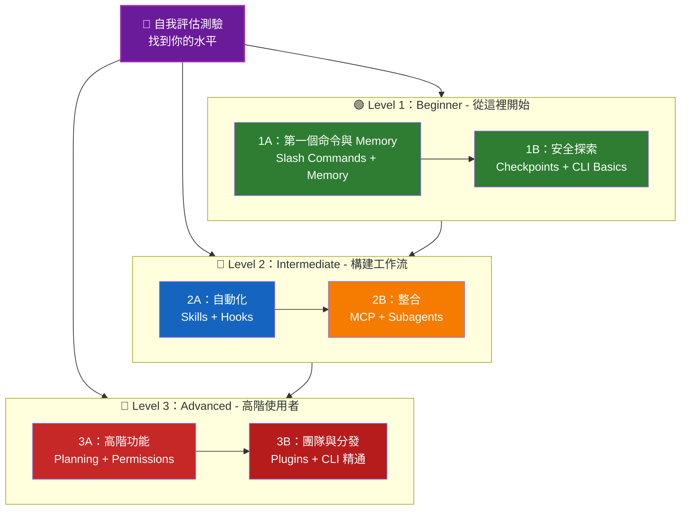

<picture>
  <source media="(prefers-color-scheme: dark)" srcset="resources/logos/claude-howto-logo-dark.svg">
  
</picture>

# 📚 Claude Code 學習路線圖

**剛接觸 Claude Code？** 這份指南會幫你按照自己的節奏掌握 Claude Code 的各項功能。無論你是完全新手，還是經驗豐富的開發者，都可以先做下面的自我評估測驗，找到最適合自己的起點。

---

<a id="find-your-level"></a>
## 🧭 找到你的水平

每個人的起點都不同。先做一份快速自我評估，確認最適合你的入口。

**請誠實回答下面的問題：**

- [ ] 我可以啟動 Claude Code 並與它對話（`claude`）
- [ ] 我建立或編輯過 `CLAUDE.md`
- [ ] 我至少使用過 3 個內建 slash command（例如 `/help`、`/compact`、`/model`）
- [ ] 我建立過自定義 slash command 或 skill（`SKILL.md`）
- [ ] 我配置過 MCP server（例如 GitHub、資料庫）
- [ ] 我在 `~/.claude/settings.json` 中設定過 hooks
- [ ] 我建立或使用過自定義 subagents（`.claude/agents/`）
- [ ] 我使用過 print mode（`claude -p`）做指令碼或 CI/CD

**你的水平：**

| 勾選數 | 水平 | 從這裡開始 | 完成時間 |
|--------|-------|----------|------------------|
| 0-2 | **Level 1：Beginner** - 從這裡開始 | [里程碑 1A](#里程碑-1a第一個命令與-memory) | 約 3 小時 |
| 3-5 | **Level 2：Intermediate** - 構建工作流 | [里程碑 2A](#里程碑-2a自動化skills--hooks) | 約 5 小時 |
| 6-8 | **Level 3：Advanced** - 高階使用者與團隊負責人 | [里程碑 3A](#里程碑-3a高階功能) | 約 5 小時 |

> **提示**：如果不確定，寧可從低一級開始。先回顧熟悉內容，總比漏掉基礎概念更划算。

> **互動式版本**：在 Claude Code 中執行 `/self-assessment`，就能得到一份引導式、互動式測驗，會覆蓋全部 10 個功能領域，並生成個性化學習路徑。

---

## 🎯 學習理念

本倉庫裡的資料夾是按照**推薦學習順序**編號的，背後有 3 個原則：

1. **依賴關係** - 先學基礎概念
2. **複雜度** - 先學簡單功能，再學高階功能
3. **使用頻率** - 先學最常用的功能

這樣可以讓你一邊建立扎實基礎，一邊儘快獲得實際收益。

---

## 🗺️ 你的學習路徑



**顏色說明：**
- 💜 紫色：自我評估測驗
- 🟢 綠色：Level 1 - Beginner 路線
- 🔵 藍色 / 🟡 金色：Level 2 - Intermediate 路線
- 🔴 紅色：Level 3 - Advanced 路線

---

## 📊 完整路線圖表

| 步驟 | 功能 | 複雜度 | 時間 | 水平 | 依賴 | 為什麼學它 | 關鍵收益 |
|------|---------|-----------|------|-------|--------------|----------------|--------------|
| **1** | [Slash Commands](01-slash-commands/README.md) | ⭐ Beginner | 30 分鐘 | Level 1 | 無 | 快速獲得生產力提升（55+ 內建命令 + 5 個 bundled skills） | 立即自動化、統一團隊規範 |
| **2** | [Memory](02-memory/README.md) | ⭐⭐ Beginner+ | 45 分鐘 | Level 1 | 無 | 所有功能的基礎 | 持久上下文、偏好設定 |
| **3** | [Checkpoints](08-checkpoints/README.md) | ⭐⭐ Intermediate | 45 分鐘 | Level 1 | 會話管理 | 安全探索 | 試驗、恢復 |
| **4** | [CLI Basics](10-cli/README.md) | ⭐⭐ Beginner+ | 30 分鐘 | Level 1 | 無 | 核心 CLI 用法 | 互動式與 print mode |
| **5** | [Skills](03-skills/README.md) | ⭐⭐ Intermediate | 1 小時 | Level 2 | Slash Commands | 自動化專業能力 | 可複用能力、一致性 |
| **6** | [Hooks](06-hooks/README.md) | ⭐⭐ Intermediate | 1 小時 | Level 2 | 工具、命令 | 工作流自動化（25 個事件、4 種型別） | 校驗、質量門禁 |
| **7** | [MCP](05-mcp/README.md) | ⭐⭐⭐ Intermediate+ | 1 小時 | Level 2 | 配置 | 實時資料訪問 | 實時整合、API |
| **8** | [Subagents](04-subagents/README.md) | ⭐⭐⭐ Intermediate+ | 1.5 小時 | Level 2 | Memory、命令 | 處理複雜任務（包含 Bash 在內的 6 個內建 agent） | 委派、專業分工 |
| **9** | [Advanced Features](09-advanced-features/README.md) | ⭐⭐⭐⭐⭐ Advanced | 2-3 小時 | Level 3 | 前面所有內容 | 高階工具 | Planning、自動模式（Auto Mode）、通道（Channels）、語音輸入、許可權控制 |
| **10** | [Plugins](07-plugins/README.md) | ⭐⭐⭐⭐ Advanced | 2 小時 | Level 3 | 前面所有內容 | 完整解決方案 | 團隊入職、分發 |
| **11** | [CLI Mastery](10-cli/README.md) | ⭐⭐⭐ Advanced | 1 小時 | Level 3 | 建議：全部 | 掌握命令列用法 | 指令碼、CI/CD、自動化 |

**總學習時間**：約 11-13 小時（或者直接跳到你的水平，節省時間）

---

## 🟢 Level 1：Beginner - 從這裡開始

**適合**：測驗勾選數 0-2
**時間**：約 3 小時
**重點**：立刻提升生產力，理解基礎概念
**結果**：可以熟練日常使用，並準備進入 Level 2

<a id="milestone-1a-first-commands-memory"></a>
### 里程碑 1A：第一個命令與 Memory

**主題**：Slash Commands + Memory
**時間**：1-2 小時
**複雜度**：⭐ Beginner
**目標**：透過自定義命令和持久上下文，快速提升效率

#### 你將完成什麼
✅ 為重複性任務建立自定義 slash commands
✅ 為團隊規範設定專案 memory
✅ 配置個人偏好
✅ 理解 Claude 如何自動載入上下文

#### 實戰練習

```bash
# 練習 1：安裝你的第一個 slash command
mkdir -p .claude/commands
cp 01-slash-commands/optimize.md .claude/commands/

# 練習 2：建立專案 memory
cp 02-memory/project-CLAUDE.md ./CLAUDE.md

# 練習 3：試用一下
# 在 Claude Code 中輸入：/optimize
```

#### 成功標準
- [ ] 成功執行 `/optimize`
- [ ] Claude 記住了 `CLAUDE.md` 中的專案規範
- [ ] 你知道什麼時候用 slash command，什麼時候用 memory

#### 下一步
熟悉之後，請閱讀：
- [01-slash-commands/README.md](01-slash-commands/README.md)
- [02-memory/README.md](02-memory/README.md)

> **檢查理解**：在 Claude Code 中執行 `/lesson-quiz slash-commands` 或 `/lesson-quiz memory`，檢驗你學會了多少。

---

### 里程碑 1B：安全探索

**主題**：Checkpoints + CLI Basics
**時間**：1 小時
**複雜度**：⭐⭐ Beginner+
**目標**：學會安全試驗，並使用核心 CLI 命令

#### 你將完成什麼
✅ 建立和恢復 checkpoints，安全試驗
✅ 理解互動模式與 print mode
✅ 使用基本 CLI 引數和選項
✅ 透過管道處理檔案

#### 實戰練習

```bash
# 練習 1：嘗試 checkpoint 工作流
# 在 Claude Code 中：
# 做一些實驗性修改，然後按 Esc+Esc 或使用 /rewind
# 選擇你實驗之前的 checkpoint
# 選擇“恢復程式碼和對話”返回

# 練習 2：互動模式 vs 輸出模式（Print mode）
claude "explain this project"           # 互動模式
claude -p "explain this function"       # 輸出模式（非互動）

# 練習 3：透過管道處理檔案內容
cat error.log | claude -p "explain this error"
```

#### 成功標準
- [ ] 成功建立並回退到一個 checkpoint
- [ ] 使用過互動模式和 print mode
- [ ] 把檔案透過管道傳給 Claude 做分析
- [ ] 明白什麼時候該用 checkpoints 做安全試驗

#### 下一步
- 閱讀：[08-checkpoints/README.md](08-checkpoints/README.md)
- 閱讀：[10-cli/README.md](10-cli/README.md)
- **準備進入 Level 2！** 繼續看 [里程碑 2A](#里程碑-2a自動化skills--hooks)

> **檢查理解**：執行 `/lesson-quiz checkpoints` 或 `/lesson-quiz cli`，確認你準備好進入 Level 2。

---

## 🔵 Level 2：Intermediate - 構建工作流

**適合**：測驗勾選數 3-5
**時間**：約 5 小時
**重點**：自動化、整合、任務委派
**結果**：可以構建自動化工作流、接入外部服務，並準備進入 Level 3

### 前置條件檢查

開始 Level 2 之前，先確認你已經掌握這些 Level 1 內容：

- [ ] 會建立和使用 slash commands（[01-slash-commands/README.md](01-slash-commands/README.md)）
- [ ] 會透過 `CLAUDE.md` 設定專案 memory（[02-memory/README.md](02-memory/README.md)）
- [ ] 知道如何建立和恢復 checkpoints（[08-checkpoints/README.md](08-checkpoints/README.md)）
- [ ] 會在命令列使用 `claude` 和 `claude -p`（[10-cli/README.md](10-cli/README.md)）

> **有空缺？** 繼續之前，先回顧上面的連結教程。

---

<a id="milestone-2a-automation-skills-hooks"></a>
### 里程碑 2A：自動化（Skills + Hooks）

**主題**：Skills + Hooks
**時間**：2-3 小時
**複雜度**：⭐⭐ Intermediate
**目標**：自動化常見工作流和質量檢查

#### 你將完成什麼
✅ 透過 YAML frontmatter 自動觸發專門能力（包含 `effort` 和 `shell` 欄位）
✅ 在 25 個 hook 事件上設定事件驅動自動化
✅ 使用 4 種 hook 型別（command、http、prompt、agent）
✅ 強制執行程式碼質量標準
✅ 為自己的工作流建立自定義 hooks

#### 實戰練習

```bash
# 練習 1：安裝一個 skill
cp -r 03-skills/code-review ~/.claude/skills/

# 練習 2：設定 hooks
mkdir -p ~/.claude/hooks
cp 06-hooks/pre-tool-check.sh ~/.claude/hooks/
chmod +x ~/.claude/hooks/pre-tool-check.sh

# 練習 3：在 settings 中配置 hooks
# 新增到 ~/.claude/settings.json：
{
  "hooks": {
    "PreToolUse": [
      {
        "matcher": "Bash",
        "hooks": [
          {
            "type": "command",
            "command": "~/.claude/hooks/pre-tool-check.sh"
          }
        ]
      }
    ]
  }
}
```

#### 成功標準
- [ ] 在相關場景下，程式碼審查 skill 會自動觸發
- [ ] PreToolUse hook 會在工具執行前執行
- [ ] 你理解 skill 自動觸發和 hook 事件觸發的區別

#### 下一步
- 建立你自己的 custom skill
- 為工作流增加更多 hooks
- 閱讀：[03-skills/README.md](03-skills/README.md)
- 閱讀：[06-hooks/README.md](06-hooks/README.md)

> **檢查理解**：在繼續之前，執行 `/lesson-quiz skills` 或 `/lesson-quiz hooks` 測試你的理解。

---

### 里程碑 2B：整合（MCP + Subagents）

**主題**：MCP + Subagents
**時間**：2-3 小時
**複雜度**：⭐⭐⭐ Intermediate+
**目標**：整合外部服務，並把複雜任務委派出去

#### 你將完成什麼
✅ 從 GitHub、資料庫等位置訪問實時資料
✅ 把工作委派給專門化 AI agents
✅ 明白什麼時候該用 MCP，什麼時候該用 subagents
✅ 構建整合式工作流

#### 實戰練習

```bash
# 練習 1：設定 GitHub MCP
export GITHUB_TOKEN="your_github_token"
claude mcp add github -- npx -y @modelcontextprotocol/server-github

# 練習 2：測試 MCP 整合
# 在 Claude Code 中：/mcp__github__list_prs

# 練習 3：安裝 subagents
mkdir -p .claude/agents
cp 04-subagents/*.md .claude/agents/
```

#### 整合練習
試試這個完整工作流：
1. 用 MCP 獲取一個 GitHub PR
2. 讓 Claude 把審查任務委派給 code-reviewer subagent
3. 再用 hooks 自動執行測試

#### 成功標準
- [ ] 能透過 MCP 成功查詢 GitHub 資料
- [ ] Claude 會把複雜任務委派給 subagents
- [ ] 你理解 MCP 和 subagents 的區別
- [ ] 能把 MCP + subagents + hooks 組合進一個工作流

#### 下一步
- 配置更多 MCP servers（資料庫、Slack 等）
- 為你的領域建立自定義 subagents
- 閱讀：[05-mcp/README.md](05-mcp/README.md)
- 閱讀：[04-subagents/README.md](04-subagents/README.md)
- **準備進入 Level 3！** 繼續看 [里程碑 3A](#里程碑-3a高階功能)

> **檢查理解**：執行 `/lesson-quiz mcp` 或 `/lesson-quiz subagents`，確認你準備好進入 Level 3。

---

## 🔴 Level 3：Advanced - 高階使用者與團隊負責人

**適合**：測驗勾選數 6-8
**時間**：約 5 小時
**重點**：團隊工具、CI/CD、企業功能、外掛開發
**結果**：成為高階使用者，能夠搭建團隊工作流和 CI/CD

### 前置條件檢查

開始 Level 3 之前，先確認你已經掌握這些 Level 2 內容：

- [ ] 會建立並自動觸發 skills（[03-skills/README.md](03-skills/README.md)）
- [ ] 會配置 hooks 做事件驅動自動化（[06-hooks/README.md](06-hooks/README.md)）
- [ ] 會配置 MCP servers 訪問外部資料（[05-mcp/README.md](05-mcp/README.md)）
- [ ] 知道如何用 subagents 分派任務（[04-subagents/README.md](04-subagents/README.md)）

> **有空缺？** 繼續之前，先回顧上面的連結教程。

---

<a id="milestone-3a-advanced-features"></a>
### 里程碑 3A：高階功能

**主題**：高階功能（Planning、Permissions、Extended Thinking、自動模式（Auto Mode）、通道（Channels）、語音輸入（Voice Dictation）、Remote/Desktop/Web）
**時間**：2-3 小時
**複雜度**：⭐⭐⭐⭐⭐ Advanced
**目標**：掌握高階工作流和高階工具

#### 你將完成什麼
✅ 為複雜功能使用 planning mode
✅ 用 6 種模式進行細粒度許可權控制（default、acceptEdits、plan、auto、dontAsk、bypassPermissions）
✅ 用 Alt+T / Option+T 切換 extended thinking
✅ 管理後臺任務
✅ 使用 Auto Memory 記住偏好
✅ 使用自動模式（Auto Mode）和後臺安全分類器
✅ 使用通道（Channels）組織多會話工作流
✅ 使用語音輸入（Voice Dictation）解放雙手
✅ 遠端控制、桌面應用和 Web 會話
✅ 使用 Agent Teams 協作

#### 實戰練習

```bash
# 練習 1：使用 planning mode
/plan Implement user authentication system

# 練習 2：嘗試許可權模式（共有 6 種：default、acceptEdits、plan、auto、dontAsk、bypassPermissions）
claude --permission-mode plan "analyze this codebase"
claude --permission-mode acceptEdits "refactor the auth module"
claude --permission-mode auto "implement the feature"

# 練習 3：啟用 extended thinking
# 在會話中按 Alt+T（macOS 上是 Option+T）切換

# 練習 4：高階 checkpoint 工作流
# 1. 建立名為 "Clean state" 的 checkpoint
# 2. 使用 planning mode 設計功能
# 3. 透過 subagent 委派實現
# 4. 在後臺執行測試
# 5. 如果測試失敗，回退到 checkpoint
# 6. 嘗試另一種方案

# 練習 5：嘗試自動模式（Auto mode，後臺安全分類器）
claude --permission-mode auto "implement user settings page"

# 練習 6：啟用 agent teams
export CLAUDE_AGENT_TEAMS=1
# 讓 Claude 執行："Implement feature X using a team approach"

# 練習 7：定時任務
/loop 5m /check-status
# 或使用 CronCreate 建立持久化定時任務

# 練習 8：用通道（Channels）管理多會話工作流
# 用 channels 來組織跨會話工作

# 練習 9：語音輸入（Voice Dictation）
# 用語音輸入和 Claude Code 進行無手操作
```

#### 成功標準
- [ ] 為複雜功能使用過 planning mode
- [ ] 配置過許可權模式（plan、acceptEdits、auto、dontAsk）
- [ ] 用 Alt+T / Option+T 切換過 extended thinking
- [ ] 使用過帶後臺安全分類器的自動模式（Auto mode）
- [ ] 使用過後臺任務處理長時間操作
- [ ] 探索過通道（Channels）做多會話工作流
- [ ] 嘗試過語音輸入（Voice Dictation）做無手輸入
- [ ] 理解 Remote Control、Desktop App 和 Web 會話
- [ ] 啟用並使用過 Agent Teams 做協作任務
- [ ] 用過 `/loop` 做週期任務或定時監控

#### 下一步
- 閱讀：[09-advanced-features/README.md](09-advanced-features/README.md)

> **檢查理解**：執行 `/lesson-quiz advanced`，測試你對高階功能的掌握程度。

---

### 里程碑 3B：團隊與分發（Plugins + CLI 精通）

**主題**：Plugins + CLI 精通 + CI/CD
**時間**：2-3 小時
**複雜度**：⭐⭐⭐⭐ Advanced
**目標**：搭建團隊工具、建立外掛、熟練整合 CI/CD

#### 你將完成什麼
✅ 安裝和建立完整的 bundled plugins
✅ 掌握 CLI，用於指令碼和自動化
✅ 使用 `claude -p` 做 CI/CD 整合
✅ 為自動化流水線輸出 JSON
✅ 管理會話與批處理

#### 實戰練習

```bash
# 練習 1：安裝一個完整 plugin
# 在 Claude Code 中：/plugin install pr-review

# 練習 2：讓 print mode 服務於 CI/CD
claude -p "Run all tests and generate report"

# 練習 3：為指令碼輸出 JSON
claude -p --output-format json "list all functions"

# 練習 4：會話管理與恢復
claude -r "feature-auth" "continue implementation"

# 練習 5：帶約束的 CI/CD 整合
claude -p --max-turns 3 --output-format json "review code"

# 練習 6：批處理
for file in *.md; do
  claude -p --output-format json "summarize this: $(cat $file)" > ${file%.md}.summary.json
done
```

#### CI/CD 整合練習
建立一個簡單的 CI/CD 指令碼：
1. 用 `claude -p` 審查變更檔案
2. 把結果輸出成 JSON
3. 用 `jq` 處理特定問題
4. 整合進 GitHub Actions 工作流

---

## 🧪 測試你的知識

根據你剛學完的內容，直接執行下面的測驗：

```bash
/lesson-quiz slash-commands
/lesson-quiz memory
/lesson-quiz checkpoints
/lesson-quiz cli
/lesson-quiz skills
/lesson-quiz hooks
/lesson-quiz mcp
/lesson-quiz subagents
/lesson-quiz advanced-features
```

---

## ⚡ 快速開始路徑

### 如果你只有 15 分鐘
**目標**：先拿到一個立竿見影的成果

1. 複製一個 slash command：`cp 01-slash-commands/optimize.md .claude/commands/`
2. 在 Claude Code 中試一下：`/optimize`
3. 閱讀：[01-slash-commands/README.md](01-slash-commands/README.md)

**結果**：你會得到一個能用的 slash command，並理解基礎用法

---

### 如果你有 1 小時
**目標**：搭好基礎生產力工具

1. **Slash commands**（15 分鐘）：複製並測試 `/optimize` 和 `/pr`
2. **專案 memory**（15 分鐘）：用專案規範建立 `CLAUDE.md`
3. **安裝一個 skill**（15 分鐘）：配置 code-review skill
4. **一起試用**（15 分鐘）：感受它們如何協同工作

**結果**：命令、memory 和自動 skills 帶來基礎效率提升

---

### 如果你有一個週末
**目標**：熟悉大部分功能

**週六上午**（3 小時）：
- 完成里程碑 1A：Slash Commands + Memory
- 完成里程碑 1B：Checkpoints + CLI Basics

**週六下午**（3 小時）：
- 完成里程碑 2A：Skills + Hooks
- 完成里程碑 2B：MCP + Subagents

**週日**（4 小時）：
- 完成里程碑 3A：高階功能
- 完成里程碑 3B：Plugins + CLI 精通 + CI/CD
- 為你的團隊構建一個自定義 plugin

**結果**：你會成為 Claude Code 的高階使用者，能夠培訓別人並自動化複雜工作流

---

## 💡 學習建議

### ✅ 建議做

- **先做測驗**，找到自己的起點
- **完成每個里程碑的實戰練習**
- **先從簡單開始**，再逐步增加複雜度
- **在進入下一個功能前先測試當前功能**
- **記下哪些做法最適合你的工作流**
- **學習新內容時回頭複習基礎概念**
- **藉助 checkpoints 安全試驗**
- **把經驗分享給團隊**

### ❌ 不建議做

- **不要跳過前置條件檢查**
- **不要試圖一次學完所有內容**
- **不要照搬配置卻不理解它們**
- **不要忘記測試**
- **不要急著跳過里程碑**
- **不要忽視檔案**
- **不要把自己隔離起來**

---

## 🎓 學習風格

### 視覺型學習者
- 閱讀每個 README 裡的 Mermaid 圖
- 觀察命令執行流程
- 自己畫工作流圖
- 使用上面的視覺化路徑圖

### 動手型學習者
- 完成每個實戰練習
- 試試不同變體
- 先搞壞再修復（記得用 checkpoints）
- 建立自己的示例

### 閱讀型學習者
- 認真閱讀每個 README
- 研究程式碼示例
- 看對比表
- 閱讀資源區連結的部落格文章

### 社交型學習者
- 組織結對程式設計
- 給隊友講解概念
- 參與 Claude Code 社群討論
- 分享你的自定義配置

---

## 📈 進度追蹤

用這些清單按水平追蹤進度。你可以隨時執行 `/self-assessment` 更新自己的技能畫像，也可以在每個教程後執行 `/lesson-quiz [lesson]` 驗證理解。

### 🟢 Level 1：Beginner
- [ ] 完成 [01-slash-commands](01-slash-commands/README.md)
- [ ] 完成 [02-memory](02-memory/README.md)
- [ ] 建立第一個自定義 slash command
- [ ] 設定專案 memory
- [ ] **達到里程碑 1A**
- [ ] 完成 [08-checkpoints](08-checkpoints/README.md)
- [ ] 完成 [10-cli](10-cli/README.md) 基礎部分
- [ ] 建立並回退到一個 checkpoint
- [ ] 使用互動模式和 print mode
- [ ] **達到里程碑 1B**

### 🔵 Level 2：Intermediate
- [ ] 完成 [03-skills](03-skills/README.md)
- [ ] 完成 [06-hooks](06-hooks/README.md)
- [ ] 安裝第一個 skill
- [ ] 設定 PreToolUse hook
- [ ] **達到里程碑 2A**
- [ ] 完成 [05-mcp](05-mcp/README.md)
- [ ] 完成 [04-subagents](04-subagents/README.md)
- [ ] 連線 GitHub MCP
- [ ] 建立自定義 subagent
- [ ] 把多個整合組合進一個工作流
- [ ] **達到里程碑 2B**

### 🔴 Level 3：Advanced
- [ ] 完成 [09-advanced-features](09-advanced-features/README.md)
- [ ] 成功使用 planning mode
- [ ] 配置許可權模式（包含 auto 在內的 6 種）
- [ ] 使用帶安全分類器的自動模式（Auto mode）
- [ ] 使用 extended thinking 切換
- [ ] 探索通道（Channels）和語音輸入（Voice Dictation）
- [ ] **達到里程碑 3A**
- [ ] 完成 [07-plugins](07-plugins/README.md)
- [ ] 完成 [10-cli](10-cli/README.md) 的高階用法
- [ ] 配置 print mode（`claude -p`）用於 CI/CD
- [ ] 為自動化建立 JSON 輸出
- [ ] 把 Claude 整合到 CI/CD 流水線
- [ ] 建立團隊 plugin
- [ ] **達到里程碑 3B**

---

## 🆘 常見學習難題

### 難題 1：“概念一下子太多了”
**解決**：一次只關注一個里程碑。完成所有練習後再往下走。

### 難題 2：“不知道什麼時候該用哪個功能”
**解決**：回到主 README 裡的 [Use Case Matrix](README.md#你能用它做什麼)。

### 難題 3：“配置沒有生效”
**解決**：檢查主 README 裡的 [Troubleshooting](README.md#故障排查) 部分，並確認檔案路徑。

### 難題 4：“概念之間好像重疊”
**解決**：檢視主 README 裡的 [Feature Comparison](README.md#功能對比) 表，理解差異。

### 難題 5：“太多東西記不住”
**解決**：自己做一份速查表；同時用 checkpoints 安全試驗。

### 難題 6：“我經驗很足，但不知道從哪裡開始”
**解決**：先做上面的 [自我評估測驗](#-找到你的水平)，直接跳到你的水平，並用前置條件檢查詢出空缺。

---

## 🎯 學完之後做什麼？

完成所有里程碑後，可以繼續做這些事：

1. **寫團隊檔案** - 記錄團隊的 Claude Code 配置
2. **構建自定義 plugins** - 把團隊工作流打包起來
3. **探索 Remote Control** - 透過外部工具以程式設計方式控制 Claude Code 會話
4. **試試 Web Sessions** - 用瀏覽器介面遠端開發
5. **使用 Desktop App** - 透過原生桌面應用訪問 Claude Code
6. **使用自動模式（Auto Mode）** - 讓 Claude 在後臺安全分類器保護下自主工作
7. **啟用 Auto Memory** - 讓 Claude 隨時間自動學習你的偏好
8. **設定 Agent Teams** - 讓多個 agent 協同處理複雜、多維任務
9. **使用通道（Channels）** - 用結構化的多會話工作流組織工作
10. **試試語音輸入（Voice Dictation）** - 用語音無障礙地與 Claude Code 互動
11. **使用 Scheduled Tasks** - 藉助 `/loop` 和 cron 工具自動化週期性檢查
12. **貢獻示例** - 把經驗分享給社群
13. **帶新人** - 幫助隊友快速上手
14. **持續最佳化工作流** - 根據使用情況不斷改進
15. **保持更新** - 跟進 Claude Code 釋出和新功能

---

## 📚 其他資源

### 官方檔案
- [Claude Code Documentation](https://code.claude.com/docs/en/overview)
- [Anthropic Documentation](https://docs.anthropic.com)
- [MCP Protocol Specification](https://modelcontextprotocol.io)

### 部落格文章
- [Discovering Claude Code Slash Commands](https://medium.com/@luongnv89/discovering-claude-code-slash-commands-cdc17f0dfb29)

### 社群
- [Anthropic Cookbook](https://github.com/anthropics/anthropic-cookbook)
- [MCP Servers Repository](https://github.com/modelcontextprotocol/servers)

---

## 💬 反饋與支援

- **發現問題？** 在倉庫裡建立 issue
- **有建議？** 提交 pull request
- **需要幫助？** 檢視檔案，或者向社群提問

---

**最後更新**：2026 年 3 月
**維護者**：Claude How-To Contributors
**許可證**：僅供學習與參考，免費使用和改編

---

[← 返回主 README](README.md)
