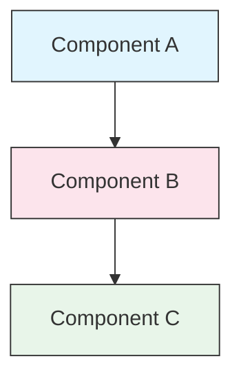

<picture>
  <source media="(prefers-color-scheme: dark)" srcset="resources/logos/claude-howto-logo-dark.svg">
  
</picture>

# 風格指南

> 為 Claude How To 貢獻內容時遵循的約定和格式規則。請按照這份指南保持內容一致、專業且易於維護。

---

## 目錄

- [檔案與資料夾命名](#檔案與資料夾命名)
- [檔案結構](#檔案結構)
- [標題](#標題)
- [文字格式](#文字格式)
- [列表](#列表)
- [表格](#表格)
- [程式碼塊](#程式碼塊)
- [連結與交叉引用](#連結與交叉引用)
- [圖表](#圖表)
- [Emoji 用法](#emoji-用法)
- [YAML Frontmatter](#yaml-frontmatter)
- [圖片與媒體](#圖片與媒體)
- [語氣與文風](#語氣與文風)
- [提交資訊](#提交資訊)
- [作者檢查清單](#作者檢查清單)

---

## 檔案與資料夾命名

### 課程資料夾

課程資料夾使用一個 **兩位數字字首**，後接一個 **kebab-case** 描述符：

```
01-slash-commands/
02-memory/
03-skills/
04-subagents/
05-mcp/
```

這個數字反映了學習路徑的順序，從初學者到高階。

### 檔名

| 型別 | 約定 | 示例 |
|------|-----------|----------|
| **課程 README** | `README.md` | `01-slash-commands/README.md` |
| **功能檔案** | kebab-case `.md` | `code-reviewer.md`, `generate-api-docs.md` |
| **Shell 指令碼** | kebab-case `.sh` | `format-code.sh`, `validate-input.sh` |
| **配置檔案** | 標準名稱 | `.mcp.json`, `settings.json` |
| **記憶檔案** | 帶作用域字首 | `project-CLAUDE.md`, `personal-CLAUDE.md` |
| **頂層檔案** | UPPER_CASE `.md` | `CATALOG.md`, `QUICK_REFERENCE.md`, `CONTRIBUTING.md` |
| **圖片資源** | kebab-case | `pr-slash-command.png`, `claude-howto-logo.svg` |

### 規則

- 除頂層檔案外，所有檔案和資料夾名都使用 **小寫**
- 使用連字元（`-`）作為單詞分隔符，永遠不要使用下劃線或空格
- 名稱要具體，但保持簡潔

---

## 檔案結構

### 根 README

根目錄 `README.md` 的順序如下：

1. Logo（使用帶深色/淺色變體的 `<picture>` 元素）
2. H1 標題
3. 引導性引用塊（一句話價值主張）
4. “為什麼需要這份指南？”部分，以及對比表
5. 分隔線（`---`）
6. 目錄
7. 功能目錄
8. 快速導航
9. 學習路徑
10. 功能章節
11. 快速上手
12. 最佳實踐 / 故障排查
13. 參與貢獻 / 許可證

### 課程 README

每個課程 `README.md` 的順序如下：

1. H1 標題，例如 `# Slash Commands`
2. 簡短概述段落
3. 快速參考表格（可選）
4. 架構圖（Mermaid）
5. 詳細章節（H2）
6. 實用示例（編號列表，4-6 個示例）
7. 最佳實踐（Do's 和 Don'ts 表）
8. 故障排查
9. 相關指南 / 官方檔案
10. 檔案後設資料頁尾

### 功能/示例檔案

單個功能檔案，例如 `optimize.md`、`pr.md`：

1. YAML frontmatter（如果適用）
2. H1 標題
3. 目的 / 描述
4. 使用說明
5. 程式碼示例
6. 自定義提示

### 分隔線

使用水平分隔線（`---`）來分隔檔案中的主要區域：

```markdown
---

## New Major Section
```

將它們放在引導性引用塊之後，以及檔案中邏輯上不同的部分之間。

---

## 標題

### 層級

| 級別 | 用途 | 示例 |
|-------|-----|---------|
| `#` H1 | 頁面標題，每個檔案一個 | `# Slash Commands` |
| `##` H2 | 主要章節 | `## Best Practices` |
| `###` H3 | 子章節 | `### Adding a Skill` |
| `####` H4 | 再下一級子章節，較少使用 | `#### Configuration Options` |

### 規則

- **每個檔案只允許一個 H1**，即頁面標題
- **不要跳級**，不要從 H2 直接跳到 H4
- **標題要簡潔**，儘量控制在 2-5 個詞
- **使用句首大寫**，只大寫首字和專有名詞（例外：功能名保持原樣）
- **只有根 README 的章節標題** 可以使用 Emoji 字首，見 [Emoji 用法](#emoji-用法)

---

## 文字格式

### 強調

| 樣式 | 使用時機 | 示例 |
|-------|------------|---------|
| **粗體** (`**text**`) | 關鍵術語、表格標籤、重要概念 | `**Installation**:` |
| *斜體* (`*text*`) | 技術術語首次出現、書名或檔名 | `*frontmatter*` |
| `Code` (`` `text` ``) | 檔名、命令、配置值、程式碼引用 | `` `CLAUDE.md` `` |

### 使用引述塊做提示

對重要說明使用帶粗體字首的引述塊：

```markdown
> **Note**: Custom slash commands have been merged into skills since v2.0.

> **Important**: Never commit API keys or credentials.

> **Tip**: Combine memory with skills for maximum effectiveness.
```

支援的提示型別：**Note**、**Important**、**Tip**、**Warning**。

### 段落

- 保持段落簡短，2-4 句為宜
- 段落之間留一個空行
- 先說重點，再補充上下文
- 解釋“為什麼”，不只是“是什麼”

---

## 列表

### 無序列表

使用短橫線（`-`），巢狀時使用 2 個空格縮排：

```markdown
- First item
- Second item
  - Nested item
  - Another nested item
    - Deep nested (avoid going deeper than 3 levels)
- Third item
```

### 有序列表

用於順序步驟、操作說明和排序項：

```markdown
1. First step
2. Second step
   - Sub-point detail
   - Another sub-point
3. Third step
```

### 說明性列表

對鍵值對風格的列表，使用粗體標籤：

```markdown
- **Performance bottlenecks** - identify O(n^2) operations, inefficient loops
- **Memory leaks** - find unreleased resources, circular references
- **Algorithm improvements** - suggest better algorithms or data structures
```

### 規則

- 保持一致的縮排，每層 2 個空格
- 列表前後都要空一行
- 列表項結構要平行一致，例如都用動詞開頭，或者都用名詞開頭
- 巢狀深度不要超過 3 層

---

## 表格

### 標準格式

```markdown
| Column 1 | Column 2 | Column 3 |
|----------|----------|----------|
| Data     | Data     | Data     |
```

### 常見表格模式

**功能對比（3-4 列）：**

```markdown
| Feature | Invocation | Persistence | Best For |
|---------|-----------|------------|----------|
| **Slash Commands** | Manual (`/cmd`) | Session only | Quick shortcuts |
| **Memory** | Auto-loaded | Cross-session | Long-term learning |
```

**Do's and Don'ts：**

```markdown
| Do | Don't |
|----|-------|
| Use descriptive names | Use vague names |
| Keep files focused | Overload a single file |
```

**快速參考：**

```markdown
| Aspect | Details |
|--------|---------|
| **Purpose** | Generate API documentation |
| **Scope** | Project-level |
| **Complexity** | Intermediate |
```

### 規則

- 當表頭是行標籤時，**表頭要加粗**
- 程式碼原始檔中的管道符儘量對齊，便於閱讀（可選但推薦）
- 單元格內容要簡潔；細節用連結展開
- 命令和檔案路徑在單元格中要使用 `程式碼格式`

---

## 程式碼塊

### 語言標籤

始終為語法高亮指定語言標籤：

| 語言 | 標籤 | 用途 |
|----------|-----|---------|
| Shell | `bash` | CLI 命令、指令碼 |
| Python | `python` | Python 程式碼 |
| JavaScript | `javascript` | JS 程式碼 |
| TypeScript | `typescript` | TS 程式碼 |
| JSON | `json` | 配置檔案 |
| YAML | `yaml` | Frontmatter、配置 |
| Markdown | `markdown` | Markdown 示例 |
| SQL | `sql` | 資料庫查詢 |
| Plain text | (no tag) | 期望輸出、目錄樹 |

### 約定

```bash
# Comment explaining what the command does
claude mcp add notion --transport http https://mcp.notion.com/mcp
```

- 在不明顯的命令前新增一行 **註釋**
- 所有示例都要做到 **可直接複製貼上**
- 相關時同時提供 **簡單版和高階版**
- 需要時要給出 **期望輸出**，這時使用不帶標籤的程式碼塊

### 安裝示例

安裝說明請使用以下模式：

```bash
# Copy files to your project
cp 01-slash-commands/*.md .claude/commands/
```

### 多步驟工作流

```bash
# Step 1: Create the directory
mkdir -p .claude/commands

# Step 2: Copy the templates
cp 01-slash-commands/*.md .claude/commands/

# Step 3: Verify installation
ls .claude/commands/
```

---

## 連結與交叉引用

### 內部連結（相對路徑）

內部連結全部使用相對路徑：

```markdown
[Slash Commands](01-slash-commands/README.md)
[Skills Guide](03-skills/README.md)
[Memory Architecture](02-memory/README.md)
```

從課程資料夾返回根目錄或兄弟目錄：

```markdown
[返回主指南](README.md)
[相關：Skills](03-skills/README.md)
```

### 外部連結（絕對路徑）

使用完整 URL，並使用具有描述性的錨文字：

```markdown
[Anthropic's official documentation](https://code.claude.com/docs/en/overview)
```

- 不要使用“click here”或“this link”作為錨文字
- 使用脫離上下文也能理解的描述性文字

### 章節錨點

連結到同一檔案中的章節時，使用 GitHub 風格錨點：

```markdown
[檔案與資料夾命名](#檔案與資料夾命名)
[作者檢查清單](#作者檢查清單)
```

### 相關指南模式

課程末尾要附上相關指南章節：

```markdown
## Related Guides

- [Slash Commands](01-slash-commands/README.md) - 快速快捷命令
- [Memory](02-memory/README.md) - 持久上下文
- [Skills](03-skills/README.md) - 可複用能力
```

---

## 圖表

### Mermaid

所有圖表都使用 Mermaid。支援的型別包括：

- `graph TB` / `graph LR` - 架構、層級、流程
- `sequenceDiagram` - 互動流程
- `timeline` - 時間順序

### 樣式約定

使用 style block 保持顏色一致：



**顏色調色盤：**

| Color | Hex | Use For |
|-------|-----|---------|
| Light blue | `#e1f5fe` | Primary components, inputs |
| Light pink | `#fce4ec` | Processing, middleware |
| Light green | `#e8f5e9` | Outputs, results |
| Light yellow | `#fff9c4` | Configuration, optional |
| Light purple | `#f3e5f5` | User-facing, UI |

### 規則

- 節點標籤使用 `["Label text"]`，這樣可以包含特殊字元
- 在標籤中換行使用 `<br/>`
- 圖表保持簡潔，最多 10-12 個節點
- 圖表下方新增簡短文字說明，方便無障礙閱讀
- 層級結構使用自上而下（`TB`），流程使用左右（`LR`）

---

## Emoji 用法

### Emoji 的使用場景

Emoji 使用要 **剋制且有目的**，只在特定場景中出現：

| 場景 | Emoji | 示例 |
|---------|--------|---------|
| Root README 章節標題 | 分類圖示 | `## 📚 Learning Path` |
| Skill 等級指示 | 彩色圓點 | 🟢 Beginner, 🔵 Intermediate, 🔴 Advanced |
| Do's 和 Don'ts | 對勾/叉號 | ✅ Do this, ❌ Don't do this |
| 複雜度評級 | 星星 | ⭐⭐⭐ |

### 標準 Emoji 集合

| Emoji | 含義 |
|-------|---------|
| 📚 | 學習、指南、檔案 |
| ⚡ | 快速上手、速查 |
| 🎯 | 功能、速查 |
| 🎓 | 學習路徑 |
| 📊 | 統計、對比 |
| 🚀 | 安裝、快速命令 |
| 🟢 | 初學者級別 |
| 🔵 | 中級別 |
| 🔴 | 高階別 |
| ✅ | 推薦做法 |
| ❌ | 避免 / 反模式 |
| ⭐ | 複雜度評級單位 |

### 規則

- **不要在正文或段落中使用 Emoji**
- **只在根 README 的標題中使用 Emoji**，不要在課程 README 中使用
- **不要新增裝飾性 Emoji**，每個 Emoji 都應該有意義
- Emoji 的使用要與上表保持一致

---

## YAML Frontmatter

### 功能檔案（Skills、Commands、Agents）

```yaml
---
name: unique-identifier
description: What this feature does and when to use it
allowed-tools: Bash, Read, Grep
---
```

### 可選欄位

```yaml
---
name: my-feature
description: Brief description
argument-hint: "[file-path] [options]"
allowed-tools: Bash, Read, Grep, Write, Edit
model: opus                        # opus, sonnet, or haiku
disable-model-invocation: true     # User-only invocation
user-invocable: false              # Hidden from user menu
context: fork                      # Run in isolated subagent
agent: Explore                     # Agent type for context: fork
---
```

### 規則

- Frontmatter 放在檔案最頂部
- `name` 欄位使用 **kebab-case**
- `description` 保持為一句話
- 只包含真正需要的欄位

---

## 圖片與媒體

### Logo 模式

所有以 Logo 開頭的檔案都使用 `<picture>` 元素，以支援深色/淺色模式：

```html
<picture>
  <source media="(prefers-color-scheme: dark)" srcset="resources/logos/claude-howto-logo-dark.svg">
  
</picture>
```

### 截圖

- 存放在對應課程資料夾中，例如 `01-slash-commands/pr-slash-command.png`
- 使用 kebab-case 檔名
- 包含描述性的 alt 文字
- 圖表優先使用 SVG，截圖優先使用 PNG

### 規則

- 圖片始終要有 alt 文字
- 控制圖片檔案大小，PNG 儘量小於 500KB
- 圖片引用使用相對路徑
- 圖片存放在引用它的檔案同目錄，或者放在 `assets/` 裡供共享使用

---

## 語氣與文風

### 寫作風格

- **專業但親切** - 技術準確，同時不過度堆砌術語
- **主動語態** - 說“Create a file”，不要說“一個檔案應該被建立”
- **直接指令** - 說“Run this command”，不要說“你也許可以執行這個命令”
- **適合初學者** - 假設讀者是 Claude Code 新手，但不是程式設計新手

### 內容原則

| 原則 | 示例 |
|-----------|---------|
| **Show, don't tell** | 提供可執行示例，而不是抽象描述 |
| **漸進式複雜度** | 先簡單，後面再增加深度 |
| **解釋“為什麼”** | “Use memory for... because...” 而不只是 “Use memory for...” |
| **可直接複製貼上** | 每個程式碼塊都應能直接貼上使用 |
| **真實場景** | 使用實際場景，而不是牽強的例子 |

### 詞彙

- 使用 “Claude Code”（不要寫 “Claude CLI” 或 “the tool”）
- 使用 “skill”（不要寫 “custom command”，這是舊術語）
- 使用 “lesson” 或 “guide” 來稱呼編號章節
- 使用 “example” 來稱呼單個功能檔案

---

## 提交資訊

遵循 [Conventional Commits](https://www.conventionalcommits.org/)：

```
type(scope): description
```

### 型別

| Type | Use For |
|------|---------|
| `feat` | 新功能、示例或指南 |
| `fix` | Bug 修復、糾正、損壞連結 |
| `docs` | 檔案改進 |
| `refactor` | 只重構、不改變行為 |
| `style` | 僅格式化改動 |
| `test` | 測試新增或修改 |
| `chore` | 構建、依賴、CI |

### 作用域

使用課程名稱或檔案區域作為作用域：

```
feat(slash-commands): Add API documentation generator
docs(memory): Improve personal preferences example
fix(README): Correct table of contents link
docs(skills): Add comprehensive code review skill
```

---

## 檔案後設資料頁尾

課程 README 以後設資料塊結尾：

```markdown
---
**Last Updated**: April 2026
**Claude Code Version**: 2.1.119
**Compatible Models**: Claude Sonnet 4.6, Claude Opus 4.7, Claude Haiku 4.5
```

- 使用“月份 + 年份”格式，例如 “March 2026”
- 功能變化時更新版本
- 列出所有相容模型

---

## 作者檢查清單

提交內容前，請確認：

- [ ] 檔案/資料夾名使用 kebab-case
- [ ] 檔案以 H1 標題開頭，每個檔案一個
- [ ] 標題層級正確，沒有跳級
- [ ] 所有程式碼塊都帶語言標籤
- [ ] 程式碼示例可直接複製貼上
- [ ] 內部連結使用相對路徑
- [ ] 外部連結使用描述性錨文字
- [ ] 表格格式正確
- [ ] Emoji 遵循標準集合（如果使用）
- [ ] Mermaid 圖表使用標準配色
- [ ] 沒有敏感資訊，例如 API key、憑據
- [ ] YAML frontmatter 有效（如果適用）
- [ ] 圖片有 alt 文字
- [ ] 段落簡短且聚焦
- [ ] 相關指南章節連結到合適的課程
- [ ] 提交資訊符合 conventional commits 格式
