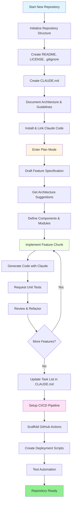
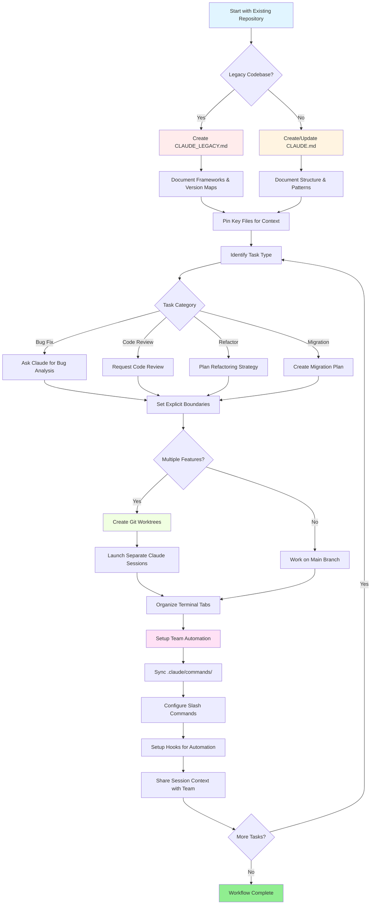

<picture>
  <source media="(prefers-color-scheme: dark)" srcset="resources/logos/claude-howto-logo-dark.svg">
  
</picture>

# 優質資源清單

## 官方檔案

| 資源 | 說明 | 連結 |
|----------|-------------|------|
| Claude Code 檔案 | Claude Code 官方檔案 | [code.claude.com/docs/en/overview](https://code.claude.com/docs/en/overview) |
| Anthropic 檔案 | Anthropic 完整檔案 | [docs.anthropic.com](https://docs.anthropic.com) |
| MCP Protocol | Model Context Protocol 規範 | [modelcontextprotocol.io](https://modelcontextprotocol.io) |
| MCP Servers | 官方 MCP server 實現 | [github.com/modelcontextprotocol/servers](https://github.com/modelcontextprotocol/servers) |
| Anthropic Cookbook | 程式碼示例和教程 | [github.com/anthropics/anthropic-cookbook](https://github.com/anthropics/anthropic-cookbook) |
| Claude Code Skills | 社群技能倉庫 | [github.com/anthropics/skills](https://github.com/anthropics/skills) |
| Agent Teams | 多 agent 協作與協調 | [code.claude.com/docs/en/agent-teams](https://code.claude.com/docs/en/agent-teams) |
| Scheduled Tasks | 使用 `/loop` 和 cron 的週期性任務 | [code.claude.com/docs/en/scheduled-tasks](https://code.claude.com/docs/en/scheduled-tasks) |
| Chrome Integration | 瀏覽器自動化 | [code.claude.com/docs/en/chrome](https://code.claude.com/docs/en/chrome) |
| Keybindings | 鍵盤快捷鍵自定義 | [code.claude.com/docs/en/keybindings](https://code.claude.com/docs/en/keybindings) |
| Desktop App | 原生桌面應用 | [code.claude.com/docs/en/desktop](https://code.claude.com/docs/en/desktop) |
| Remote Control | 遠端會話控制 | [code.claude.com/docs/en/remote-control](https://code.claude.com/docs/en/remote-control) |
| Auto Mode | 自動許可權管理 | [code.claude.com/docs/en/permissions](https://code.claude.com/docs/en/permissions) |
| Channels | 多通道通訊 | [code.claude.com/docs/en/channels](https://code.claude.com/docs/en/channels) |
| Voice Dictation | Claude Code 語音輸入 | [code.claude.com/docs/en/voice-dictation](https://code.claude.com/docs/en/voice-dictation) |

## Anthropic Engineering Blog

| 文章 | 說明 | 連結 |
|---------|-------------|------|
| Code Execution with MCP | 如何透過程式碼執行解決 MCP 上下文膨脹問題，Token 數量減少 98.7% | [anthropic.com/engineering/code-execution-with-mcp](https://www.anthropic.com/engineering/code-execution-with-mcp) |

---

## 30 分鐘掌握 Claude Code

_影片_: https://www.youtube.com/watch?v=6eBSHbLKuN0

_**全部技巧**_
- **探索高階功能和快捷鍵**
  - 定期檢視 Claude 釋出說明中的新程式碼編輯與上下文功能。
  - 學習鍵盤快捷鍵，在聊天、檔案和編輯器檢視之間快速切換。

- **高效設定**
  - 為專案建立帶有清晰名稱和描述的會話，便於之後查詢。
  - 將最常用的檔案或資料夾固定住，讓 Claude 隨時可訪問。
  - 配置 Claude 的整合，例如 GitHub 和常見 IDE，以簡化你的編碼流程。

- **高效的程式碼庫問答**
  - 向 Claude 詢問架構、設計模式和具體模組的細節問題。
  - 在問題裡使用檔案和行號引用，例如：“`app/models/user.py` 裡的邏輯是在做什麼？”
  - 對於大型程式碼庫，提供摘要或清單，幫助 Claude 聚焦。
  - **示例提示詞**：_“你能解釋一下 `src/auth/AuthService.ts:45-120` 裡實現的認證流程嗎？它是如何與 `src/middleware/auth.ts` 裡的中介軟體整合的？”_

- **程式碼編輯與重構**
  - 使用程式碼塊中的內聯註釋或請求來獲得更聚焦的編輯結果（例如：“把這個函式重構得更清晰一些”）。
  - 讓 Claude 給出並排的修改前後對比。
  - 在重大修改後，讓 Claude 生成測試或檔案，以保證質量。
  - **示例提示詞**：_“把 `api/users.js` 裡的 `getUserData` 函式從 promises 改成 async/await。給我一個修改前後對比，併為重構後的版本生成單元測試。”_

- **上下文管理**
  - 只貼上當前任務真正需要的程式碼和上下文。
  - 使用結構化提示詞（“這裡是檔案 A，這裡是函式 B，我的問題是 X”）通常效果最好。
  - 在提示視窗裡移除或摺疊大檔案，避免超出上下文限制。
  - **示例提示詞**：_“這裡是 `models/User.js` 裡的 User 模型，以及 `utils/validation.js` 裡的 `validateUser` 函式。我的問題是：如何在保持向後相容的前提下新增郵箱驗證？”_

- **接入團隊工具**
  - 將 Claude 會話連線到你們團隊的程式碼倉庫和檔案。
  - 使用內建模板，或為重複出現的工程任務建立自定義模板。
  - 透過和隊友共享會話記錄與提示詞來協作。

- **提升效能**
  - 給 Claude 清晰、面向目標的指令，例如：“用五個要點總結這個類”。
  - 從上下文視窗中刪掉不必要的註釋和樣板程式碼。
  - 如果 Claude 的輸出跑偏了，重置上下文或重新表述問題，以獲得更好的對齊。
  - **示例提示詞**：_“用五個要點總結 `src/db/Manager.ts` 裡的 `DatabaseManager` 類，重點說明它的核心職責和關鍵方法。”_

- **實用場景示例**
  - 除錯：貼上錯誤和堆疊資訊，然後詢問可能的原因和修復方式。
  - 生成測試：為複雜邏輯請求屬性測試、單元測試或整合測試。
  - 程式碼審查：請 Claude 識別風險變更、邊界情況或程式碼異味。
  - **示例提示詞**：
    - _“我遇到這個錯誤：`TypeError: Cannot read property 'map' of undefined at line 42 in components/UserList.jsx`。這是堆疊資訊和相關程式碼。是什麼原因導致的？我該怎麼修復？”_
    - _“為 `PaymentProcessor` 類生成完整的單元測試，包括失敗交易、超時和無效輸入等邊界情況。”_
    - _“審查這個 pull request diff，找出潛在的安全問題、效能瓶頸和程式碼異味。”_

- **工作流自動化**
  - 用 Claude 提示詞為格式化、清理、批次重新命名等重複任務編寫指令碼。
  - 用 Claude 基於程式碼 diff 起草 PR 描述、釋出說明或檔案。
  - **示例提示詞**：_“根據 git diff，生成一份詳細的 PR 描述，包含變更摘要、修改檔案列表、測試步驟和潛在影響。同時為 2.3.0 版本生成釋出說明。”_

**提示**：想要獲得最佳效果，可以把這些實踐組合起來使用。先固定關鍵檔案並總結目標，再使用聚焦的提示詞和 Claude 的重構工具，逐步改進你的程式碼庫和自動化流程。

**與 Claude Code 配合使用的推薦工作流**

### Claude Code 推薦工作流

#### 新倉庫場景

1. **初始化倉庫並接入 Claude**
   - 建立新倉庫的基礎結構：`README`、`LICENSE`、`.gitignore`、根配置檔案。
   - 建立 `CLAUDE.md`，說明架構、高層目標和編碼規範。
   - 安裝 Claude Code，並將其連線到倉庫，用於程式碼建議、測試腳手架和工作流自動化。

2. **使用計劃模式和規格說明**
   - 在實現功能之前，使用計劃模式（`shift-tab` 或 `/plan`）先寫詳細規格。
   - 讓 Claude 給出架構建議和初始專案佈局。
   - 保持清晰、面向目標的提示詞序列，依次詢問元件輪廓、主要模組和職責。

3. **迭代開發與審查**
   - 把核心功能拆成小塊逐步實現，並在過程中請求 Claude 生成程式碼、重構和檔案。
   - 每增加一小步，都請求單元測試和示例。
   - 在 `CLAUDE.md` 中維護持續更新的任務列表。

4. **自動化 CI/CD 和部署**
   - 用 Claude 搭建 GitHub Actions、npm/yarn 指令碼或部署工作流。
   - 透過更新 `CLAUDE.md` 並請求對應命令/指令碼，輕鬆調整流水線。

#### 現有倉庫場景

1. **倉庫與上下文準備**
   - 新增或更新 `CLAUDE.md`，記錄倉庫結構、編碼模式和關鍵檔案。對於舊倉庫，可以使用 `CLAUDE_LEGACY.md`，其中涵蓋框架、版本對映、說明、已知問題和升級筆記。
   - 固定或高亮 Claude 應該用來作為上下文的主檔案。

2. **上下文驅動的程式碼問答**
   - 讓 Claude 基於具體檔案/函式，回答程式碼審查、 bug 解釋、重構或遷移計劃。
   - 給 Claude 明確邊界，例如“只修改這些檔案”或者“不要新增依賴”。

3. **分支、工作區和多會話管理**
   - 使用多個 git worktree 做隔離的功能開發或 bug 修復，併為每個 worktree 啟動獨立的 Claude 會話。
   - 透過終端標籤頁/視窗按分支或功能組織並行工作。

4. **團隊工具和自動化**
   - 透過 `.claude/commands/` 同步自定義命令，保持團隊一致性。
   - 用 Claude 的 slash commands 或 hooks 自動化重複任務、PR 建立和程式碼格式化。
   - 與團隊成員共享會話和上下文，便於協作排障和審查。

**提示**：
- 每個新功能或修復都從規格和計劃模式提示詞開始。
- 對於舊倉庫和複雜倉庫，把更詳細的指導存放在 `CLAUDE.md` / `CLAUDE_LEGACY.md` 中。
- 給出清晰、聚焦的指令，把複雜工作拆成多階段計劃。
- 定期清理會話、裁剪上下文，並刪除已完成的工作區，避免堆積混亂。

這些步驟概括了在新舊程式碼庫中更順暢使用 Claude Code 的核心建議。

---

## 2026 年 3 月新增功能與能力

### 關鍵功能資源

| 功能 | 說明 | 瞭解更多 |
|---------|-------------|------------|
| **Auto Memory** | Claude 會自動學習並記住你跨會話的偏好 | [記憶指南](02-memory/README.md) |
| **Remote Control** | 透過外部工具和指令碼以程式設計方式控制 Claude Code 會話 | [高階功能](09-advanced-features/README.md) |
| **Web Sessions** | 透過基於瀏覽器的介面訪問 Claude Code，實現遠端開發 | [CLI 參考](10-cli/README.md) |
| **Desktop App** | Claude Code 的原生桌面應用，介面更強大 | [Claude Code 檔案](https://code.claude.com/docs/en/desktop) |
| **Extended Thinking** | 透過 `Alt+T` / `Option+T` 或 `MAX_THINKING_TOKENS` 環境變數切換深度推理 | [高階功能](09-advanced-features/README.md) |
| **Permission Modes** | 精細許可權控制：default、acceptEdits、plan、auto、dontAsk、bypassPermissions | [高階功能](09-advanced-features/README.md) |
| **7-Tier Memory** | Managed Policy、Project、Project Rules、User、User Rules、Local、Auto Memory | [記憶指南](02-memory/README.md) |
| **Hook Events** | 25 個事件：PreToolUse、PostToolUse、PostToolUseFailure、Stop、StopFailure、SubagentStart、SubagentStop、Notification、Elicitation 等 | [Hooks 指南](06-hooks/README.md) |
| **Agent Teams** | 協調多個 agent 共同處理複雜任務 | [Subagents 指南](04-subagents/README.md) |
| **Scheduled Tasks** | 用 `/loop` 和 cron 工具設定週期性任務 | [高階功能](09-advanced-features/README.md) |
| **Chrome Integration** | 使用無頭 Chromium 做瀏覽器自動化 | [高階功能](09-advanced-features/README.md) |
| **Keyboard Customization** | 自定義按鍵繫結，包括組合鍵序列 | [高階功能](09-advanced-features/README.md) |
